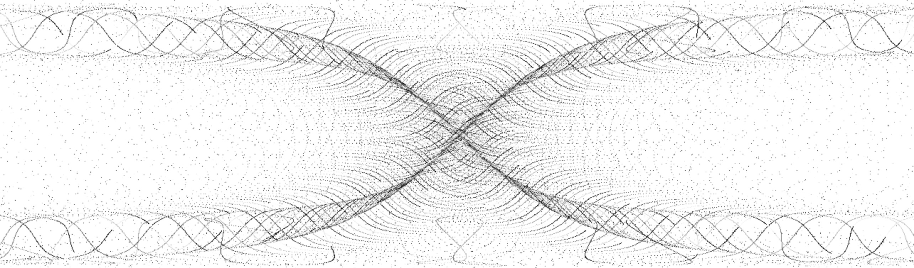
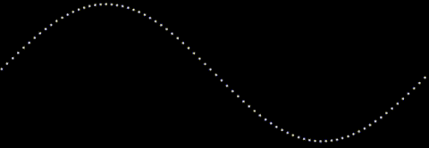

A year ago, I created a small demo of animating guilloches as two dimensional graphics on an HTML5 canvas.  In this post I revisit the beautiful and elegant patterns as 3d constructs that resonate with sounds from the physical world.

---

TL;DR - The post below describes how to build an audio visualization using WebGL (via three.js), GLSL shaders, and the Web Audio API.

The [demo](#demo) is at the bottom of this post.

The code is available at [https://github.com/binarymax/guilloche](https://github.com/binarymax/guilloche)

---
<style>
			.player { 
				z-index:5; 
				position:relative; 
				top:-20px;
			}
			.player-button { 
				float:right;
				background-color: rgba(0,0,0,0.5);
				color:#eee;
				border:0;
				width:20px;
				height:20px;
			}
			.full { 
				font-size:1.5em;
				line-height:0.8em;
				font-weight:bold;
				position:relative;
			}
</style>

##3d Guilloché

When I built the 2d animated guilloches, I had planned on eventually experimenting and growing it into a 3d version.  A whole year might seem like a long time to wait for another dimension, but that's nothing in the greater context of spacetime.

From an equation perspective, adding another dimension to an otherwise flat guilloche is trivial.  We only need add a formula to get 'z' in addition to x and y. The complicated part is the difference in displaying and animating three dimensions instead of two in the browser.

For example, By adding a third dimension, we will go from this 2d construct:



To this 3d construct:

<div>
	<div id="guilloche1"></div>
	<div class="player">
		<div id="guilloche1_play" class="player-button play" data-target="guilloche1" data-toggle="&#9724;">&#x25B6;</div>
		<div id="guilloche1_full" class="player-button full" data-target="guilloche1" data-toggle="-">+</div>
	</div>
</div>

The basic core formulae for the two images above are as follows:

```javascript
//2D
x : ((rr*Math.tan(theta)) + (rp*Math.tan(rrr*theta))) * zoom,
y : ((rr*Math.sin(theta)) - (rp*Math.sin(rrr*theta))) * zoom
```

```javascript
//3D
x : ((rr*Math.tan(theta)) + (rp*Math.tan(rrr*theta))) * zoom,
y : ((rr*Math.sin(theta)) - (rp*Math.sin(rrr*theta))) * zoom,
z : ((rr*Math.tan(theta)) + (rp*Math.cos(rrr*theta))) * zoom
```

As you can see, the x and y formulae are the same, and the z formula was added only for the 3d version.

So what's the big deal, and why is this complicated?  Well, to animate the 2d version, we only need loop and draw pixels to a typed array, before displaying on a canvas.  But to render the 3d version, we need to allocate a vertex for each point and animate them in a vertex shader.  This is not difficult once you've done it (or know how to do it), but getting to 3d from 2d requires a leap in knowledge into WebGL and GLSL shaders.

The best part however, is that the 3d version is *fast*.  The 2d render is slow since it is javascript running on the CPU in series for each point.  The GLSL shader runs in the GPU, using the parallel operations across the vertices.  This opens up lots of opportunities for experimentation, and led to the ultimate goal of the post, which is listening to the microphone and resonating the equations for a nice 90's retro style visualisation.

###WebGL

I usually like to write everything without using 3rd party libraries, but I cheated this time and used the magnificent three.js.

I won't give an exhaustive introduction into WebGL nor three.js, there are plenty of introductions and tutorials out there already.  I will just get right to the point and dive into the buffer geometry setup for the vertices of a guilloche.

Since we are interested in individual points, and not continuous objects like spheres or polygons, we use vertices in a geometry object.  To make use of GLSL shader attributes so we can animate (more on this later), we need to use the buffer geometry.  The buffer geometry lets us specify an arbitrary number of arrays to store information that can be rendered by the GPU.  In our case we will be storing the starting position of each point (represented as a vertex), and the core parameter used for calculation (theta).

For our x,y,z equations above we will loop through space and create lots of vertices for small increments over the theta param.  We start at 0 and loop through Tau at a step of some small number and, using the additional configurations of the guilloche, we end up with a gorgeous distribution of points in a 3d space.

Here is the code for the 'river' guilloche shown above.  I hard-coded the parameters for clarity:

```javascript
Math.tau = Math.PI * 2; //I wish this came as standard ;)
 
var river = function(R,r,p,step,zoom){
	var size = Math.floor(Math.tau/step);
	var geometry = new THREE.BufferGeometry();
	var positions = new Float32Array(size * 3);
	var thetas = new Float32Array(size);
	var rr = R+r;
	var rp = r+p;
	var rrr = (R+r)/r;
	for(var theta=0,x=0,y=0,i=0; i < size; i++) {			
		thetas[i] = theta;
		positions[i+0] = ((rr*Math.tan(theta)) + (rp*Math.tan(rrr*theta))) * zoom;
		positions[i+1] = ((rr*Math.sin(theta)) - (rp*Math.sin(rrr*theta))) * zoom;
		positions[i+2] = ((rr*Math.tan(theta)) + (rp*Math.cos(rrr*theta))) * zoom;
		theta+=step;
	}
	geometry.addAttribute('position',new THREE.BufferAttribute(positions,3));
	geometry.addAttribute('theta',new THREE.BufferAttribute(thetas,1));
	return geometry;
}
var geo = river( 70 , -0.25 , 25 , 0.0001 , 20 );
```

So what are R, r, p, step, and zoom?  R, r, and p alter the shape of the guilloche. Step is the increment in which we increase a counter for the number of points (related to Tau, the lower the step increases the number of vertices). Zoom is the spacing between the vertices.  I probably could have come up with better names, but naming things is the second hardest problem in computer science.

There are other important aspects of the river method above.  Namely we are adding the position and theta typed arrays as attributes to the buffer geometry.  This allows us to pass the attributes into the GLSL vertex shader and use them there during calculations for our animation.

###Animating a Sine Wave

Now that we have the construct rendered to the screen, we want to animate it in a similar way to our older 2d versions.  I didn't spend any time describing how the guilloche was animated for the 2d version, so I thought I would take the time and explain it here.  We animate each equation by incrementing the ```theta``` parameter for each vertex calculation.  How does this animate though?  Think of a simple sine wave, that is drawn with spaced points rather than a continuous curve.  Each point is a segment of Tau along a full cycle of the wave.  If we have a step of 0.001, then we are rendering the sin wave with 6283 points.  As that is stretched across the screen we see gaps between those points.  Changing the parameter by a small amount will move the points to a new position along the wave, all relative to each other.

Here is a small demonstration.  We will only show the sine wave, with 6283 points, and animate theta by incrementing one hundred thousandth of Tau (Math.tau/100000) for each frame.  This may seem like too small an amount, but at 60 frames per second, the effect is clear:



Look closely at the animation above and focus on one point.  Notice how it is only moving up and down, as we cycle through theta.  Stepping back and looking at the image as a whole gives an illusion of the wave moving from right to left.

When we do this for our more complicated guilloche equations, the effect is super awesome.  So how can we do this with our vertices in a 3d space?  With GLSL shaders...

###Vertex Shaders

The graphics pipeline has several different stages.  A shader is a stage that transforms either the position or the appearance of data in the GPU.  Since shaders are run in the GPU, and the GPU is built to parallelize calculations across their many cores, they effectively scale across the processing of the data.  In other words, they process large amounts of data more quickly than a single process on a CPU.

We will keep things simple and only cover the vertex shader stage.  Just by names alone, this should be clear - we have lots of vertices, and we need to animate them, so we use the vertex shader.  Each vertex will be processed in parallel, and it will be much faster than trying to do it all in javascript.

The shader only requires some basic setup, and then we can use the same formulae for our guilloche with only one syntax change and some boilerplate.

```c
const float pi = 3.141592653589793;
attribute float theta;
uniform float amplitude,zoom,R,Rs,r,rs,p,ps;
varying vec3 vNormal;
void main() {
	float rr = (R+r) + amplitude;
	float rp = (r+p) + sin(amplitude)/(pi*10.0);
	float rrr = (R+r)/r;
	vec3 nwPosition = vec3(
		rr*tan(theta) + rp*tan(rrr*theta) * zoom,
		rr*sin(theta) - rp*sin(rrr*theta) * zoom,
		rr*tan(theta) + rp*cos(rrr*theta) * zoom
	);
	vec4 mvPosition = modelViewMatrix * vec4( nwPosition, 1.0 );
	gl_PointSize = 1.0;
	gl_Position = projectionMatrix * mvPosition;
}
```

Ok, so there's a lot going on in there.  Let's walk through it.

PI isn't defined in GLSL, so we need to declare it ourselves.  I am using a ```const``` but some prefer to define the value to be used in a preprocessor.

Attibutes are the static values that we created in our buffer geometry.  As you recall we added the positions and the theta for our vertices.  These will be used in our calculation for animation.

Uniforms are dynamic values that we can change upstream in JavaScript and pass in to the shader for each frame render.  All the variables here, aside from amplitude, are part of our core guilloche calculation that we've always been using.  Amplitude will be covered later, when we add the audio detection!

Varyings are values that are passed to all the stages and can be changed in the vertex shader for use in the fragment shader.  The line ```varying vec3 vNormal``` is required by the vertex shader for internal use.  It can be used during shader calculation, but we don't need it ourselves, and we don't do anything special with the fragment shader, so we won't cover it in detail.

Inside of the main entry method for the shader, the same equations are used to calculate the new position of the vertex, declared as vec3 (a three dimensional vector for x,y,z).  With the new position calculated, it is aligned with the global view matrix, the size of the points set, and projected to the point on our 2d screen.

The shader code isn't javascript, so we separately place it in the HTML document wrapped in a ```<script type="x-shader/x-vertex" id="riververtexshader">...</script>``` tag for retrieval later.

###Setup and Rendering

With our base algorithms in place to draw the guilloche, we can use the standard scene, camera, and renderer from three.js to animate our construct.  We also need to pass in the baseline parameters for the guilloche including R,r, and p, and their minimums and maximums.  For the animation we rotate through the values and pass them in as uniforms to the shader.

All that looks like this:

```javascript
var width = window.innerWidth;
var height = window.innerHeight;
var scene = new THREE.Scene();
//Parameter settings and buffer geometry for the river guilloche
var inc = Math.tau/10000000;
var set = { R:70, Rs:inc, Rmin:60, Rmax:80, r:-0.25, rs:inc, rmin:-0.50, rmax:-0.01, p:25, ps:inc, pmin:4, pmax:20, zoom:12, step:0.0001 };
var geo = river(set.R, set.r, set.p, set.step, set.zoom);
var uniforms = {
	amplitude:{value:    1.0},
	zoom:{value:set.zoom*1.0},
	R:   {value:set.R   *1.0},
	Rs:  {value:set.Rs  *1.0},
	r:   {value:set.r   *1.0},
	rs:  {value:set.rs  *1.0},
	p:   {value:set.p   *1.0},
	ps:  {value:set.ps  *1.0}
};
var vertexshader = document.getElementById("riververtexshader").innerText;
var fragmentshader = document.getElementById("riverfragmentshader").innerText;
var shaders = new THREE.ShaderMaterial({
	uniforms: uniforms,
	vertexShader: vertexshader,
	fragmentShader: fragmentshader
});
var points = new THREE.Points( geo, shaders );
scene.add( points );
var camera = new THREE.PerspectiveCamera( 75, width / height, 1, 3000 );
camera.position.z = 1000;
var renderer = new THREE.WebGLRenderer();
renderer.setPixelRatio( window.devicePixelRatio );
renderer.setSize( width, height );
document.getElementById("guilloche").appendChild( renderer.domElement );
```

Lets break it down...

First we set some constants and initialize the scene.  The scene is responsible for holding the geometries so they can be seen by a camera and rendered into view on the screen.

We get some parameters for our river guilloche and get the geometry by calling the river function we defined earlier.  The parameters in ```set``` are chosen somewhat arbitrarily, and I spent a little time tweaking them to get a visual that I was happy with.

The uniforms will be used in our shader, and we need to declare them as such.  Note that since they are all float values in GLSL we coerce them into floats in javascript by multiplying by ```1.0```.  This is a hint so three.js will know the type.  The shader code is actually embedded in our document as noted above, so we get it from the DOM.  With our geometry, uniforms and shader code ready, we create the ```shaders``` object and add it as points to our scene.

We then create and position the camera and renderer for a nice scenic view and add it to the DOM to be shown on the page in the element we want.

Now that everything is initialized, the scene needs to be rendered...

```javascript
var render = function() {
	set.R = (uniforms.R.value += set.Rs);
	if(set.R<=set.Rmin || set.R>=set.Rmax) set.Rs*=-1;
	set.r = (uniforms.r.value += set.rs);
	if(set.r<=set.rmin || set.r>=set.rmax) set.rs*=-1;
	set.p = (uniforms.p.value += set.ps);
	if(set.p<=set.pmin || set.p>=set.rmax) set.ps*=-1;
	camera.lookAt( scene.position );
	renderer.render( scene, camera );
	requestAnimationFrame(render);
};

render();
```

During the render operation, we increment the uniform values.  Since we passed the uniform data into the shaders, and they are kept as reference objects, changing the value will automatically update them in the shader pipeline.  I added a little trick of oscillating the uniform parameters between min and max values, to keep it flowing nicely.  Once the uniforms are set, we render the scene, and the visual is displayed on the page.  We continuously render the scene by calling requestAnimationFrame to get a nice smooth animation.


###Multiple Geometries

With the foundations in place, layering geometries together is quite easy.  We can easily alter our code to render multiple geometries in the scene.  Each geometry needs their own equations, settings, uniforms, and shader.

In the github code I have already created many guilloche functions that you can start with, as well as a playground to make it easy to add and remove them to a scene and tweak the settings.  Feel free to have a look now, or continue reading to see how we can make our mathematics dance to some ambient noise from a microphone...

##Audio

When I first created the 3d guilloche, I was pleased but not fully satisfied.  I felt that with the computational power of shaders I could do more, and I wanted the visuals to be interactive beyond the basic fly-through controls we are used to seeing in three.js demos.  I reached deep back to the 1990's and pulled out a task of audio interaction, but I didn't want to just load in some music and make it react, I wanted to be able to control these things with my own sounds live from a microphone.  Enter the web audio API.

###Web Audio API

I had first learned of audio processing in the browser from a great talk by Soledad Penadés at Full Frontal Conference in 2014.  I knew that with the web audio API I could get some sound as an input and make it alter the appearance of the guilloche somehow.  But, when I started, I didn't really know how it worked except for some very basic theory on frequencies and amplitude.  To get a better grasp on the subject I spent several hours doing research to better learn the fundamentals of audio processing, and how it worked in the browser.  I started with some basic theory that I found on a tutorial[0] and also, as usual, MDN[1] proved to be an amazing resource with clear explanations and excellent examples.

It's been several years since Web Audio API first became available in browser builds, but to access it you still need to use prefixed objects.  To start, you need an audio context and the getUserMedia permissions (as we need to politely ask the user to use their microphone).

The strategy will be to allow our guilloche to give a callback that listens to the microphone time domain data.  This is surprisingly easy and requires very little code.  The entire microphone listener is shown below.  I won't dive into all the pieces, rather if you are interested I recommend you read the MDN documentation and tutorials, which do a much better job explaining it than I can in the scope of this post.

```javascript
navigator.getUserMedia =navigator.getUserMedia       ||
						navigator.webkitGetUserMedia ||
						navigator.mozGetUserMedia    ||
						navigator.msGetUserMedia;
var audiocontext = window.AudioContext||window.webkitAudioContext;
var microphone, analyser, listener;
var onStream = function(stream) {
	microphone = context.createMediaStreamSource(stream);
	analyser = context.createAnalyser();
	microphone.connect(analyser);
	requestAnimationFrame(analyze);
};
var onError = function(e) {
	console.error('No microphone!');
};
var analyze = function() {
	var data = new Uint8Array(analyser.frequencyBinCount);
	analyser.getByteTimeDomainData(data);
	for(var i = 0; i < data.length; i++) {
		listener(data[i]);
	}
	requestAnimationFrame(analyze);
};
var listen = function(callback) {
	listener = callback;
	context = new audiocontext();
	context.createGain = context.createGainNode;
	context.createDelay = context.createDelayNode;
	context.createScriptProcessor = context.createJavaScriptNode;
	navigator.getUserMedia( {audio: true}, onStream, onError);
};
```

###Feeding the guilloche

You may note that for the demo I used the time domain, rather than the frequency domain.  I experimented with both and for this instance decided on the former.

The only thing that we need to do now is call the ```listen``` function with a callback that can change the amplitude.  Since everything is asynchronous, we will push the microphone values to an array as they come in, and pop them out one at a time per frame render.

Here is the simple code that adds the time domain values to the array:
```javascript
var ambient = [];
listen(function(val){ambient.push(val)});
```

Here is some code that I spent some time tweaking to get the effect right.  But as you can see in the first line of the ```react``` function, we are taking the most recent ambient data value and, if no values exist, defaulting to 0.  The other code was experimented with to rotate the guilloche on the y axis, and to feed the amplitude into the shader.

```javascript
var def = Math.tau/(360*12);
var dep = Math.PI*100-Math.PI*50;
var react = function() {
	var amb = ambient.pop()||0;
	var amp = Math.max(amb/2,0);
	var rot = (amp||1)/dep;
	points.rotation.y += (rot>0?Math.max(rot,def):Math.min(rot,-def));
	uniforms.amplitude.value = amp;
};
```

The only thing left is to add the ```react``` call to the render function.  Everything else remains the same for our render as it was above:

```javascript
var render = function() {
	set.R = (uniforms.R.value += set.Rs);
	if(set.R<=set.Rmin || set.R>=set.Rmax) set.Rs*=-1;
	set.r = (uniforms.r.value += set.rs);
	if(set.r<=set.rmin || set.r>=set.rmax) set.rs*=-1;
	set.p = (uniforms.p.value += set.ps);
	if(set.p<=set.pmin || set.p>=set.rmax) set.ps*=-1;
	react();
	camera.lookAt( scene.position );
	renderer.render( scene, camera );
	requestAnimationFrame(render);
};
```

And that's it!  Lets see it in action, shall we?

<a name="demo"></a>
##Demo

Be sure to make some noise, like whistling or shouting or playing some music on your speakers, to see the effect.  If you declined to share your microphone when you first loaded the page, you can refresh to be prompted again.

<div>
	<div id="guilloche2"></div>
	<div class="player">
		<div id="guilloche2_play" class="player-button play" data-target="guilloche2" data-toggle="&#9724;">&#x25B6;</div>
		<div id="guilloche2_full" class="player-button full" data-target="guilloche2" data-toggle="-">+</div>
	</div>
</div>

The full code for the demo and others is available on [github](https://github.com/binarymax/guilloche). Enjoy!

--

##Links
- [0] http://www.asel.udel.edu/speech/tutorials/
- [1] https://developer.mozilla.org/en-US/docs/Web/API/Web_Audio_API/Using_Web_Audio_API


<script type="x-shader/x-vertex" id="vertextemplate">
		#ifdef GL_ES
		precision highp float;
		#endif

		const float pi = 3.141592653589793;

		attribute float theta;
		uniform float amplitude,zoom,R,Rs,r,rs,p,ps;
		varying vec3 vNormal;

		void main() {
			
			float rr = (R+r) + amplitude;
			float rp = (r+p) + sin(amplitude)/(pi*10.0);
			float rrr = (R+r)/r;
			vec3 nwPosition = vec3({{model}});

			vec4 mvPosition = modelViewMatrix * vec4( nwPosition, 1.0 );
			gl_PointSize = 1.0;
			gl_Position = projectionMatrix * mvPosition;
		}
</script>

<script type="x-shader/x-fragment" id="fragmentshader">
		#ifdef GL_ES
		precision highp float;
		#endif

		uniform sampler2D texture;
		varying vec3 vNormal;

		void main() {
			vec3 fNormal = vNormal;
			gl_FragColor = vec4(1.0 , 1.0 , 1.0 , 1.0);
		}
</script>


<script type="text/javascript" src="/javascripts/three.js"></script>
<script type="text/javascript" src="/javascripts/ease.js"></script>
<script type="text/javascript" src="/javascripts/mic.js"></script>
<script type="text/javascript" src="/javascripts/guilloche3d.js"></script>
<script type="text/javascript" src="/javascripts/animate3d.js"></script>
<script type="text/javascript" src="/javascripts/ambient-guilloche.js"></script>


