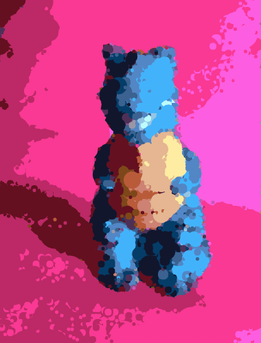

After some hammock driven development, Harissa is mature enough to release some results.  Originally intended for entire videos, I found the process better suited for only several frame remixes, usually of an identical source image.

---

 

---

 

### How it works

Take a source set of frames, with a target being each processed frame interspersed with an equal number of transition frames.  For example, if there are 4 raw images and 5 intermediate transition frames, there will be 20 frames for the final result.

There are two steps to the process, the mixer and the blender.

The mixer preprocesses each frame into circles using a genetic algorithm, as outlined in the post [Hidden Shapes][1].  The circles are stored in JSON, each with the necessary data of x, y, radius and color.

The blender takes each successive processed frame and matches the best pairs of circles from each frame.  By using a KD-Tree for nearest neighbors, each circle from one frame gets a sibling from the next successive frame.

After every circle has a sibling in its next frame, the path is animated from one to another.  A simple interpolation formula takes in x, y, and radius.  It returns an array of objects for the transition.  Each transition step becomes a new frame in the target animation.

### Research

It took awhile to refine the process, and along the way I discovered many interesting attributes of color spaces and contrast related to the algorithm.  I learned early in the project that linear distance is not a reliable way to differentiate colors, and research took me down the paths to delta-e.  I ended up keeping linear distance, however, since it gives an interesting look to the results.

As a side effect, color simplicity and high border contrast become key, for the mixer algorithm to give good representations.  Some would consider this a flaw, but it is indeed purposeful for the art.  A more accurate color difference formula would just give results similar to that of a photoshop filter.  It also forced me to keep constraints on photo style for good consistency.

[1]:/articles/hidden-shapes/
[2]:https://github.com/binarymax/harissa