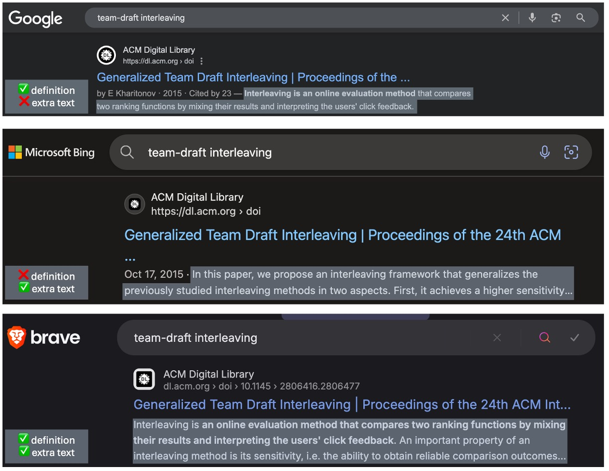
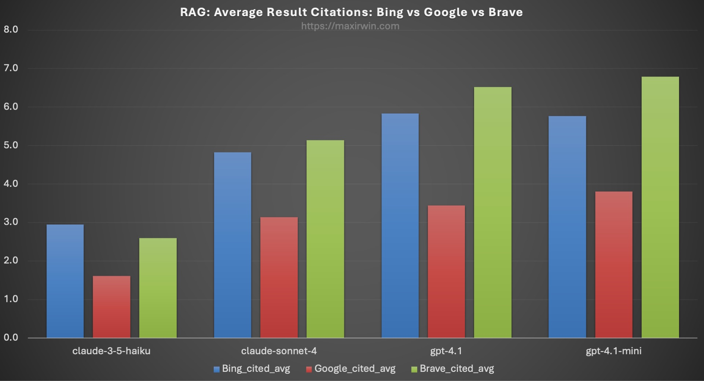
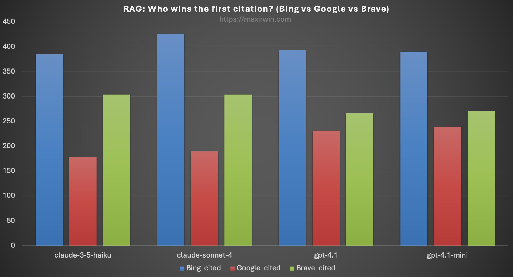
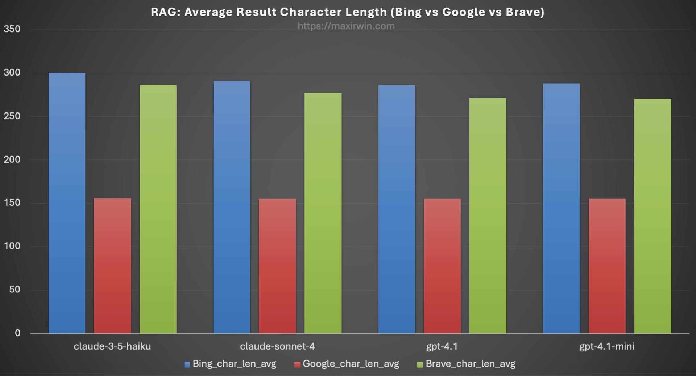
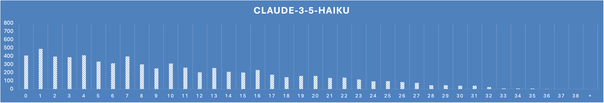
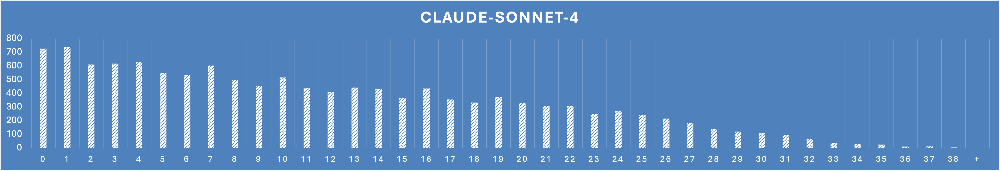
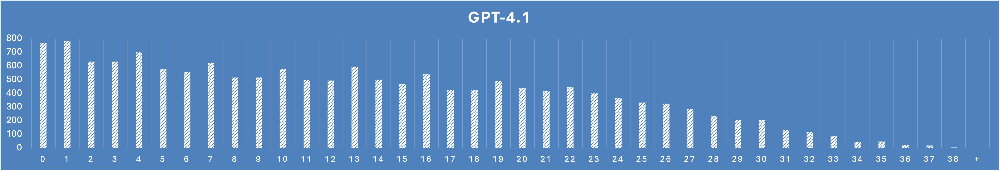
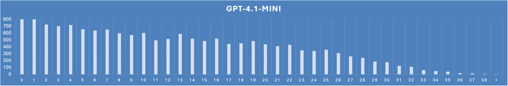

What kinds of search results work best for an LLM?  When asking this question the first thing that jumps into most minds is that of relevance. But the answer is more complex.

When exploring the best solution to the above, comparing outcomes of retrieval engine configurations one at a time poses significant challenges. This is because A/B testing and contrasting metrics robs you of understanding true comparative preference.

## Interleaving

Interleaving, the process of blending the query results of two or more engines into the same result set, gives us easy to obtain insights into the behavior of LLMs for knowledge summaries, and allows us to craft our results to align better with these behaviors.  This also avoids error prone independent comparisons.

Indeed, interleaving results for LLMs presents a comprehensive solution to not only tune actual relevance, but also tune perceived relevance.

## Perceived Relevance

The difference between actual vs perceived relevance is fascinating. The former is the empirical truth of whether or not the result contains the information necessary to satisfy the query.  Perceived relevance on the other hand, is whether or not the person looking at a search result can tell whether or not it likely contains the answer.  It's easy to understand when we're shown a picture.

Before we were all spoon fed summaries en masse at the top of our results, we actually had to look at results and make decisions with our brains.  Optimizing perceived relevance is key to making this easy for us by showing concise information about the results so we can decide what to click.

To illustrate the benefits of perceived relevance, consider an extreme example: imagine you are only presented with a list of page links as search results with no other data. Assume these are in varying order of relevance with at least one or more containing the information you need.  How can you tell which are relevant? You have to click on every result until you see the answer. This example has poor perceived relevance.

Now another extreme: each result in the list shows the entire document and you are presented with thousands of sentences to exhaustingly scroll through while hunting for what you need. This is also poor perceived relevance because again, it is difficult to tell immediately and requires significant effort.

Compare these extremes with what is typically presented: a title, a url, a short contextual snippet, and perhaps a date of publication. This allows one to scan the results and make a very quick decision on which is best before continuing further:

Google, Bing, and Brave all provide clear information that gives you enough information to make a decision on whether to click on the result. Only two snippets provide exactly the definition for the term, and only two provide extra text.  You can already see where this is going.  In this case, Bing's snippet will be useless to an LLM for summarization.

## Snippets for LLMs

LLMs behave differently than people. And while we can drop entire documents into an LLM for a summary, it’s unnecessary and expensive, and will add noise and irrelevant information - especially for trivial queries.  So we look to optimize what to gather for context when summarizing a list of results.  In essence we need a concept of perceived relevance for LLMs.

In general, the following holds: longer snippets yield better summaries.  They reduce hallucinations and improve coverage of the answer.  However if the snippets are too long, noisy tangential or irrelevant information can creep into the summary.

Additionally, while there are plenty of LLM-as-a-judge theses out there, I posit that doing this separately is a waste of time for RAG.  LLM summaries work perfectly fine over dozens of results en lieu of a well tuned top list of 4 or 5.  In effect, extreme relevance tuning becomes less important when a summary is presented, because the LLM skips the irrelevant results for you. Thus, when validating the quality of a RAG summary with citations, you also get judgements as a bonus.

We consider these two areas: optimizing context and tuning result relevance, by interleaving results and scoring the summary. This yields important information and enables you to naturally gravitate to the best retrieval configuration.

## Experiments for web search summaries

I present the following evidence in the context of RAG for web search.  I used 976 actual search queries, three interleaved engines of _Google, Bing, and Brave_ as retrievers, and four LLM models ( _Claude Haiku 3.5, Claude Sonnet 4, GPT-4.1, and GPT-4.1-Mini_ ) for summarization.  We know that these three engines are already tuned for relevance, and we know these models are state of the art for summarization. We can cross compare them by observing the outcome of the LLM summaries.

The search queries were captured over the past 6 months by users in their casual use of a research engine I built.  They are all from anonymous sources and I scrubbed them of PII (which were mostly vanity searches - you know who you are!). The queries were primarily in English, with a handful of German, Polish, Hebrew, and Armenian.  Overall they were a mix of technical, medical, legal, general research, and trivial queries. To remove bias I excluded news, politics, sports, and anything I found to be spicy.  I was left with a nice set of 976 unique and real queries from dozens of actual people.  I will note potential bias in the query list, in that the engine is primarily used by me, and my queries account for just more than half.  Even with this note the queries were always in real scenarios for my actual day-to-day use and not tests.

Here is the process: 

1. A query is run against all three engines Google, Bing, and Brave.
2. None of the engine results contain ads, as I used their official paid APIs to avoid them.
3. The results are combined into a single set using team-draft interleaving.
4. Each positional result in the interleaved set maintains its source engine name for credit assignment later on.
5. The interleaved results are formatted into a summary prompt template.
6. The prompt is sent to the LLM and the output streamed back to the system.
7. The output contains summary passages with citations of the search results.
8. A citation assigns credit to the engine that provided the result.
9. The process is repeated for all 976 the queries in the list and the outcomes tallied.

_Figure 1: Average credit assignment of citations to the respective retriever across all 4 models._

In Figure 1, we can clearly see the engine with the most citations is Bing by a significant margin, followed by Brave, and deeply lagging in third is Google.

_Figure 2: First only credit assignment of citations to the respective retriever across all 4 models._

Figure 2 only looks at who got cited first. This takes the first citation found in the summary and assigns credit to the engine that provided it. Again, the difference is clear with Bing far in the lead - however GPT has Google in a closer second place.

But why? Do we not assume that Google is the world’s best search? The answer becomes clear when we dig: for all results across all searches, the average length of a Google result snippet is 155 characters, while the average lengths of Bing and Brave are 293 and 253, respectively.  This is illustrated in Figure 3.

_Figure 3: Average character length (in bytes) for each engine's snippets_

This shows a direct correlation. The shorter snippets are very likely responsible for the LLM to pass over Google in favor of Bing’s and Brave’s longer snippets. Note the snippet length is only counted for results that are cited in the summary. Table 1 contains the raw numbers for Figures 1, 2, and 3.

<table>
<thead>
<tr><th>model</th><th>citationType</th><th>searches</th><th>Bing_cited</th><th>Bing_cited_avg</th><th>Bing_char_len_avg</th><th>Google_cited</th><th>Google_cited_avg</th><th>Google_char_len_avg</th><th>Brave_cited</th><th>Brave_cited_avg</th><th>Brave_char_len_avg</th></tr>
</thead>
<tbody>
<tr><td>claude-3-5-haiku-20241022</td><td>getCitedOnce</td><td>976</td><td>2872</td><td>2.9</td><td>300.3</td><td>1575</td><td>1.6</td><td>155.6</td><td>2529</td><td>2.6</td><td>286.8</td></tr>
<tr><td>claude-3-5-haiku-20241022</td><td>getCitedFirst</td><td>976</td><td>3929</td><td>4.0</td><td>304.8</td><td>1831</td><td>1.9</td><td>155.7</td><td>3115</td><td>3.2</td><td>292.1</td></tr>
<tr><td>claude-sonnet-4-20250514</td><td>getCitedOnce</td><td>976</td><td>4709</td><td>4.8</td><td>290.9</td><td>3064</td><td>3.1</td><td>155.1</td><td>5019</td><td>5.1</td><td>277.4</td></tr>
<tr><td>claude-sonnet-4-20250514</td><td>getCitedFirst</td><td>976</td><td>7841</td><td>8.0</td><td>298.7</td><td>3974</td><td>4.1</td><td>155.6</td><td>7099</td><td>7.3</td><td>286.1</td></tr>
<tr><td>gpt-4.1</td><td>getCitedOnce</td><td>976</td><td>5691</td><td>5.8</td><td>286.2</td><td>3357</td><td>3.4</td><td>155.1</td><td>6370</td><td>6.5</td><td>271.3</td></tr>
<tr><td>gpt-4.1</td><td>getCitedFirst</td><td>976</td><td>13455</td><td>13.8</td><td>292.6</td><td>6206</td><td>6.4</td><td>156.0</td><td>13385</td><td>13.7</td><td>281.6</td></tr>
<tr><td>gpt-4.1-mini</td><td>getCitedOnce</td><td>976</td><td>5631</td><td>5.8</td><td>288.3</td><td>3709</td><td>3.8</td><td>155.2</td><td>6630</td><td>6.8</td><td>270.4</td></tr>
<tr><td>gpt-4.1-mini</td><td>getCitedFirst</td><td>976</td><td>11276</td><td>11.6</td><td>293.4</td><td>6170</td><td>6.3</td><td>155.7</td><td>11753</td><td>12.0</td><td>278.1</td></tr>
</tbody>
</table>

_Table 1: search result citations and snippet length per model and method_

We can also garner some keen insights on relevance from a histogram of result positions cited, regardless of engine.  My research application uses lots of results for RAG.  Upwards of 40.  I do this because I learned early on in its development that relevant results often appeared past the first page of 10.  This is illustrated with histograms of cited position for each model.  You can clearly see that >10 holds significant input.

Web search agents like ChatGPT produce mediocre research due to this lack of scope, and the summaries of Google, Bing, and Brave in their own sites fall short because they assume all the good stuff is at the top.  It’s not.  You must dig deep.  There’s gold buried on the 2nd and 3rd pages!

# Conclusions

To recap, use the following lessons when building RAG or a research agent:

1. Make your snippets longer for the LLM, because cutting them short may leave critical information out of the summary.
2. Don’t worry too much about the top 5 documents, and give your LLM several pages of results. You can reorder the result on the page according to citation order.
3. Iterate and tune by interleaving different versions of your retriever configuration and see which works best for the LLM.

I propose in fact, having two snippet versions per result: one for people and one for LLMs.  Show the former in the result list on the page, and use the latter for your RAG prompt template.

## Prompts

Out of scope for this test is variation on the prompt. This is because it is already well tuned, and while I considered adding a prompt variant the costs got a bit out of hand for this post (you're looking at over $100 of search and AI credits folks!).

## Obituary Section

🪦 _RIP Bing Search API_

This article had been sitting in my brain for several months, but it was spurred by a recent event.

On Monday August 11th, 2025, Microsoft killed the Bing Search API.  This was largely ignored by the technical community, but the death of this product has an outsize impact on the quality of augmented web knowledge applications.  You can use it as part of “grounding” for their AI thing in Azure - but it removes the flexibility that I and many others need (and it’s stupid expensive).  For shame Microsoft!  This leaves Brave.  Their coverage of the web is not as good as Bing (I estimate 1/5th the scope), but otherwise a decent contender and they have very favorable API terms.