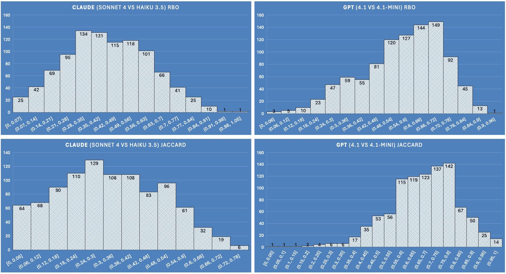
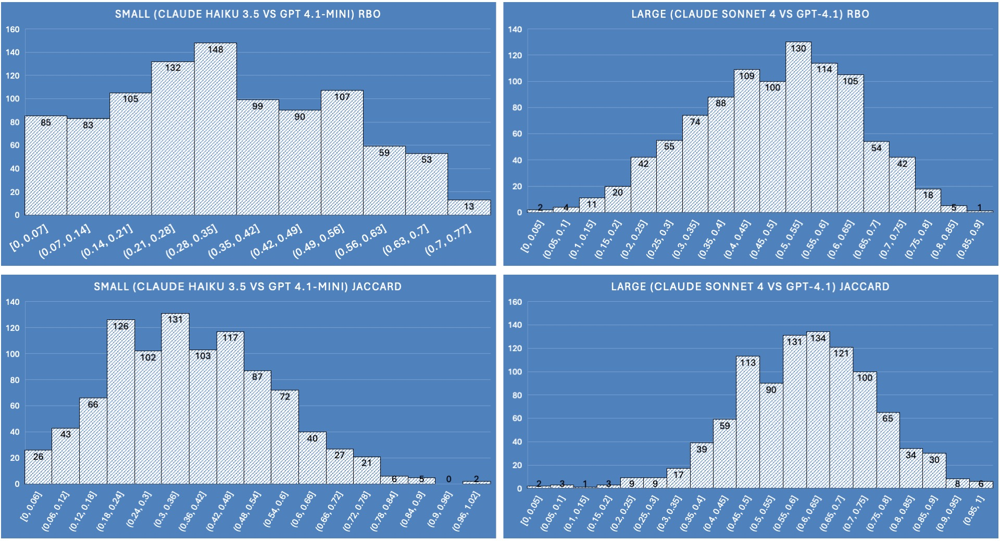
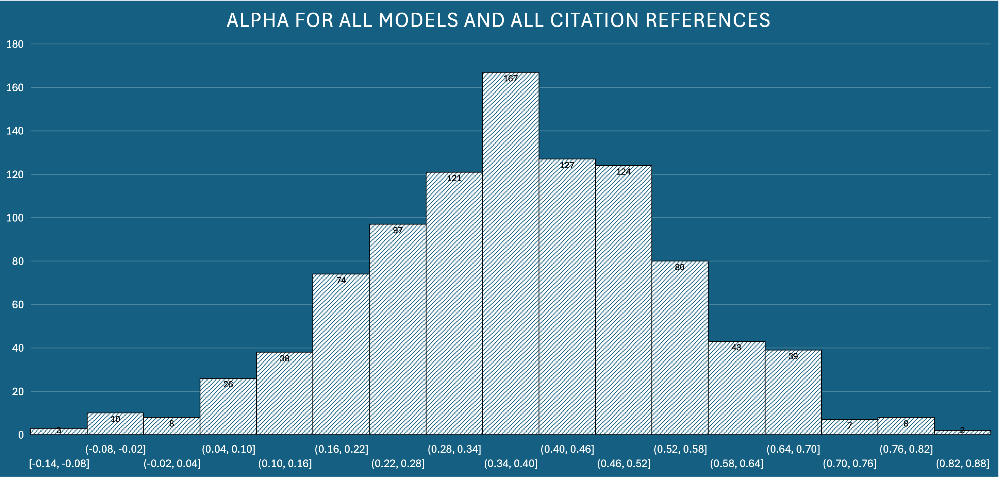
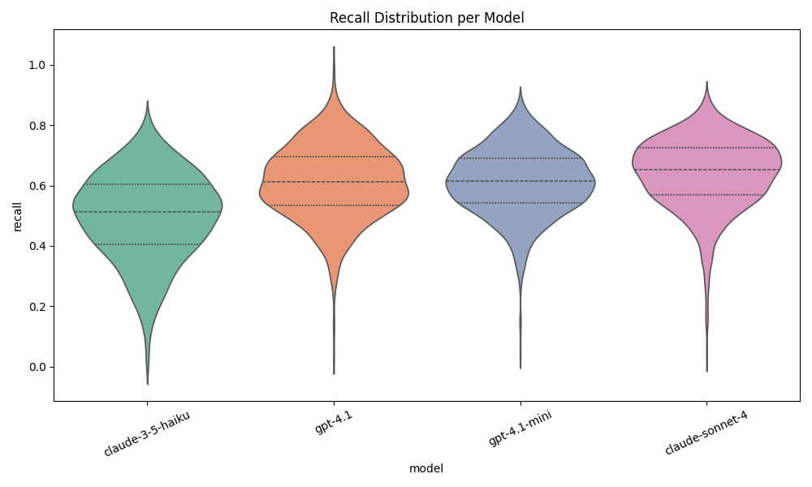
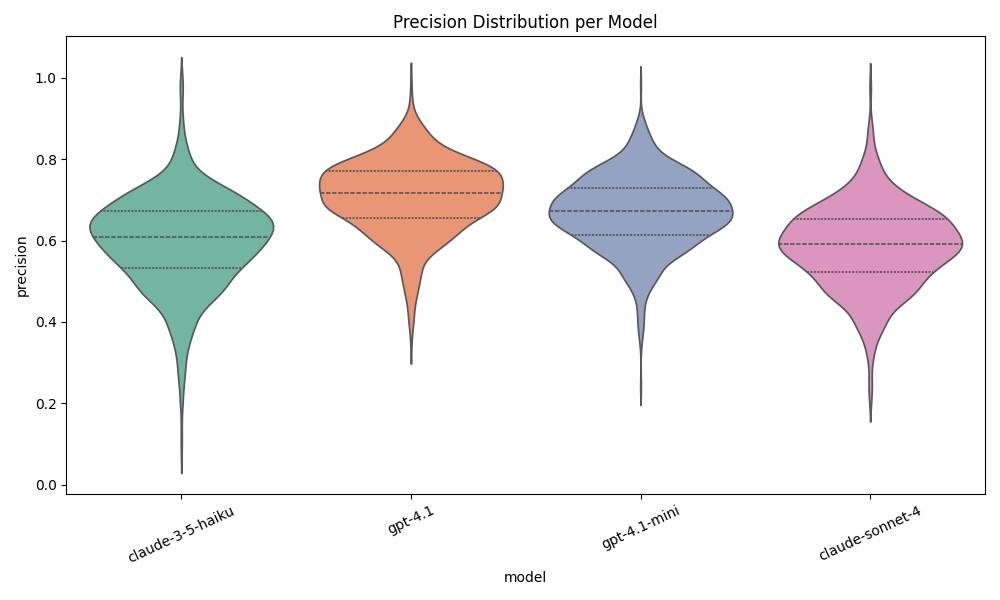
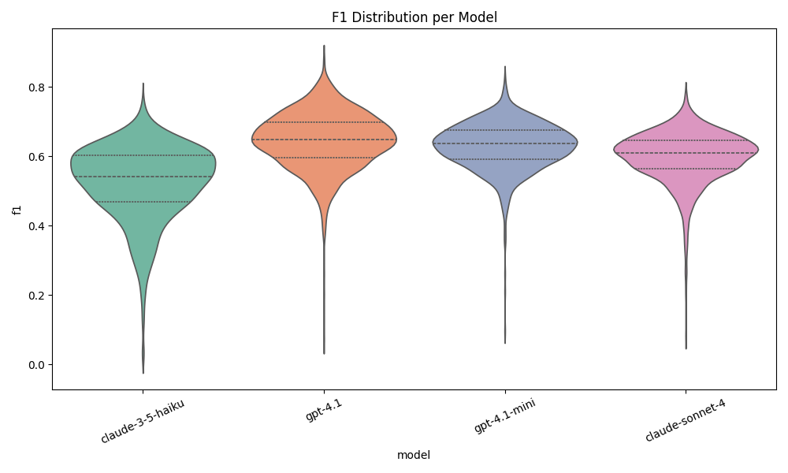

 - [Part 1 - Choosing a Retriever](../interleaving-rag)
 - Part 2 - Choosing a Model

Our goal for this part is to choose a model for RAG.  In part 1, ["Interleaving for RAG"](../interleaving-rag/) we saw how to use four different models to choose a retriever, but It is nonsensical to use four models for every summary, so we need to pick one!

I say “our goal”, but it's really “my goal”.  Because my search platform is currently using GPT-4o, and I need to move on to something better.  As I write these words I truly don't know what the answer is. But by the time I get to the end, I will have made a choice and you get to come along for the ride.

## Methodology

In part 1 we saw how engines compare to one another. In this part we see how models compare to one another.  We do this by looking at the following:

 1. Whether models agree on results to use in the summary
 2. Whether the summaries deviate from source material
 3. The cost of the summaries

For step 2, I also introduce a new and novel metric, to help understand both potential hallucinations and potential summary recall loss.

### Expectations and Coverage

I do have some preferences in the choice of the model.  I'd like quality summaries that are produced faster and at a lower cost.  With accuracy being equal I will lean to these preferred outcomes. We don't always get what we want in life (and very rarely in NLP), but we take what we can get! So I'm also looking for justification to use one of the smaller models.

First let's review what we are comparing.

We have four models, from two “families”, Anthropic's Claude and OpenAI's GPT.  Of these two families we have each a large model: Claude Sonnet 4 vs GPT-4.1, and a fast model: Claude Haiku 3.5 vs GPT-4.1-mini.

 - Claude Sonnet 4 (Anthropic, large)
 - Claude Haiku 3.5 (Anthropic, small)
 - GPT-4.1 (OpenAI, large)
 - GPT-4.1-mini (OpenAI, small)

If possible, I want to use a small/fast model for the long term.  Not only because it produces the summary faster, but also because it's cheaper.

Let's call out the Elephant in the room.  Why isn't GPT-5 on the list?  Well, I have a very good reason for that.  I stream summary responses to the client (instead of waiting several seconds for the whole thing and the showing it all at once).  OpenAI has decided to require people who want streaming with GPT-5 to submit their biometrics to a 3rd party company as “verification”.  I consider this an overreach on their part.  I won't do it and if this is the trend with OpenAI I'm happy to take my business elsewhere. GPT-4.1 doesn't require this nonsense, so it's a candidate.

What about other models? I considered adding Gemini, and maybe I will do a comparison with that model family at some point. There are dozens of models that I could look at, and I stuck with the most popular for this analysis. Were this for a client and not myself, I would certainly have added several other candidates to the mix.

## Metrics

I use three metrics to understand whether our models choose the same results (and in which priority). These metrics are Jaccard, Rank Biased Overlap, and Krippendorff's alpha.  To help with summary deviation from context (hallucinations and recall issues). I also introduce a new metric which I'm calling “concept F1”. And I also look at cost.

__Jaccard__ compares how much the result choices of two models overlap, regardless of order. This is used to see how much models deviate from each other in the choice they make for results.

__Rank Biased Overlap (RBO)__ is similar to Jaccard but takes into account the order or results. This is used to see if models agree on priority of results for the summary.

__Krippendorff's Alpha__ is very different from the other two metrics. It is used to understand probabilistic consensus between two or more judges. We can use alpha to see if all our models are likely to agree with each other on which results are chosen.

__Concept F1__ is of my own design and calls forth the NLP ancestral spirits. Its goal is to provide a number for how well the models stick to the source material.  It does this with a rather simple algorithm using one of my favorite NLP tricks: part of speech tagging.  It's kinda similar to Ragas’ “Context Entities Recall” but goes one step further.  In essence it compares the overlap of cited search results’ nouns to those found in the summary.

__Cost__ is easy to understand, but I save it for last to prevent biasing myself early on what is cheaper or more expensive.

Why these four metrics (not including cost)? We start from simple to more complex.  While _Jaccard_ and _RBO_ are useful, they are simple and only work well when comparing two models.  _Alpha_ however, we can compare more than two for a probabilistic measure of agreement.  And _Concept F1_ isn't looking for agreement between models, but we can compare adherence to the source material per model and use that to help us choose.

Importantly this approach is a good mix of agreement, scoring, and business requirements.  This focuses our task into explicit contextual comparisons for exact scenarios, and gives what we need to make an informed choice.

I'm also, for a change, not using manual judgements here. I did spend time doing this back in December 2024 when I was building the platform, and quickly found the task meaningless when using Bing, Google, and Brave.  All three engines are really the best in class for relevance. Spending time with manual relevance judgements on Google is not a good use of my time, and I can safely assume the results are relevant.  So really this exercise is about finding whether small models pick the same stuff as big models, whether models adhere to facts, and make an informed choice weighing several factors from a business perspective.

I'll also point out that average is usually a poor representation of behavior in complexity, so we'll look at histograms and violin plots to get a visual picture for the true differences of all our metrics.  If you take away *anything* from this article, it is that you should look at distributions and not averages!

Enough talk. On with the show! Here are the results:

### Jaccard & RBO

For Jaccard and RBO, this is the process.  We compare two models at a time, and not all four.
 
 1. For one query, take *two* models, and their respective summaries with citations.
 2. For each model/summary, get the citation numbers (now we have *two* lists of citations - one  per model)
 3. Calculate Jaccard
 4. Calculate RBO
 5. Do this for every query in the list (all 976 of them)
 6. Average the Jaccard and RBO results for the model pair
 7. Pick another two models and do the process again.

We plot the histograms of agreement in two different scenarios: family and size.  Up and to the right indicates stronger agreement between two models, and anything else indicates either disagreement or too much variance.

#### Family agreement

We compare how well the families agree with one another.  We compare Sonnet vs Haiku, and compare GPT-4.1 vs GPT-4.1 mini:

In this figure we can clearly see that the GPT models have strong affinity with one another.  This is likely due to GPT-4.1-mini being a distilled version of its larger sibling.  Sonnet 4 and Haiku 3.5 don't seem to agree on which results to pick.

#### Size agreement

We compare how well the models of similar size agree with one another.  We compare Sonnet vs GPT-4.1, and compare Haiku vs GPT-4.1 mini:

In this figure we can clearly see that the larger models are more likely to agree with one another than the smaller models. This reveals that consensus between the larger models may mean they are more trustworthy in their choice for relevant documents, and the small models less so.

In other words, if two independent models disagree, who can you trust?  If two independent models agree, it presents more confidence on their selection.

### Alpha

For _Alpha_ the process is a bit different than Jaccard/RBO, since we use all the results for a query and assign 1 or 0 whether it is cited by a model or not (binary relevance). We then look for agreement between two or more models using their respective binary relevance ratings.  We can then take the average of all the alpha agreement measures found.

Alpha is the overall _likelihood_ of agreement.  Numbers closer to 1 indicate very likely probability that the models will agree.  Numbers closer to -1 indicate likelihood of randomness (and not necessarily disagreement).  I read this plot as there is some agreement likelihood.  I use this as a check to make sure that the majority of these numbers are not less than 0 (that would mean I can't trust any of these models to have consensus). I am confident also that this is likely skewed by the two GPT models agreeing due to what we learned with Jaccard and RBO, but that's OK.

## Concept P/R/F1

Here's how this metric works:

 1. Get all the nouns that are found in all the results cited in the summary, and put them in a list. This represents our set of factual concepts.  We expect the summary to use these nouns, and these nouns only.
 2. Get all the nouns used in the summary.
 3. If the summary uses a noun from the factual concepts, that's a true positive.
 4. If the summary uses a new noun, not seen in the factual concepts, that's a false positive. I consider this a hallucination (more on this later)
 5. If the summary skips a noun from the factual concepts, that's a false negative. I consider this a loss of recall.
 6. With our true positives, false positives, and false negatives, we can calculate Precision, Recall, and F1 for the summary!

Why is using a new noun a hallucination? We're not asking the model for its opinion, we're asking it to compile the list of facts. Therefore we expect the summary output to be just that: a compilation of what was provided by the retriever.  If the model is introducing new concepts (nouns) that the source results material did not provide, that is a deviation from expected behavior and is suspect.

### A quick note about P/R/F1

Precision and Recall is a delicate balance in search. It requires a choice between correctness and coverage.  Some information needs require correctness (such as targeted or trivial answers), and some information needs require coverage (such as survey or broad research).  It is rare to excel at both, and usually you need to choose one or the other.  F1 provides an equal blend of the two, so that is usually the metric you end up going with since you're likely to be in both scenarios.

For concept scoring, we look at violin plots to show the distribution. Using this visualization is clearer than the histogram, since the details are easier to discern with this plot type. Distributions that clump higher are better for all three plots.

### Concept Recall

### Concept Precision

### Concept F1

These three figures make it clear who NOT to pick.  Haiku 3.5 is definitely out of the running.  I am happy with the results of the other 3 though.

## Business Metric: Cost

I am already forming an opinion on what to choose, but I'll save my choice until we see cost. These are the real business factors.

This is the last metric, but it might be the most important one.  Because if each query costs a penny each, and your platform has 10000 queries per day, that's $3000 per month in LLM costs just for the summaries. I've ordered these from most expensive to least expensive.

<table class="datasheet" style="width:100%">
<thead>
<tr><th> Model</th><th>Total cost</th><th>Cost Per Query</th></tr>
</thead>
<tbody>
<tr><td> claude-sonnet-4-20250514</td><td>$15.19</td><td>$0.0156</td></tr>
<tr><td> gpt-4.1</td><td>$8.02</td><td>$0.0082</td></tr>
<tr><td> claude-3-5-haiku-20241022</td><td>$3.46</td><td>$0.0035</td></tr>
<tr><td> gpt-4.1-mini</td><td>$1.69</td><td>$0.0017</td></tr>
</tbody>
</table>
 

This blog post cost me $28.36 in LLM API calls. If you like this post and you see me somewhere, you're welcome to buy me a coffee so I can recoup some costs :)

## Decision

Let's lay it all out and I'll make a pick.  But first, which would you choose?  I hid my choice under a spoiler tag. Go ahead and decide what you would do, make a choice and it will reveal what I picked...

### Make your choice!

Choose what model you would use based on the data above, and I'll reveal my selection!

<form id="llm-form">
	 <button id="haiku35" class="llm-choice">Claude Haiku 3.5</button> 
	 <button id="sonnet4" class="llm-choice">Claude Sonnet 4</button> 
	 <button id="gpt41" class="llm-choice">GPT 4.1</button> 
	 <button id="gpt41mini" class="llm-choice">GPT 4.1-mini</button> 
</form>

You chose <strong><em id="chosen"></em></strong>

I chose <strong><em>GPT-4.1</em></strong>. I made this choice because it is better than Sonnet in the Concept F1 metric, I see less variance of agreement with its littler sibling in case it gets too expensive, and it's also almost half the cost of Sonnet.  I am paying for accuracy here - this is my personal search engine and I want to keep the quality high and the cost is minimal to me.  Were I requiring the scale of thousands of queries per day I'd certainly re-evaluate and likely use a mini model unless I could balance it with revenue.

Comparatively the two Claude models are in violent disagreement, their Concept-F1 is lower than GPT, and they are expensive. So this was a fairly easy decision for me.

<noscript>

I chose <strong><em>GPT-4.1</em></strong>. I made this choice because it is better than Sonnet in the Concept F1 metric, I see less variance of agreement with its littler sibling in case it gets too expensive, and it's also almost half the cost of Sonnet.  I am paying for accuracy here - this is my personal search engine and I want to keep the quality high and the cost is minimal to me.  Were I requiring the scale of thousands of queries per day I'd certainly re-evaluate and likely use a mini model unless I could balance it with revenue.

Comparatively the two Claude models are in violent disagreement, their Concept-F1 is lower than GPT, and they are expensive. So this was a fairly easy decision for me.

</noscript>

---

Well that was very informative, and lots of fun.  See kids?  Data science really works!  Now I'm off to implement my model upgrade.  See you next time.