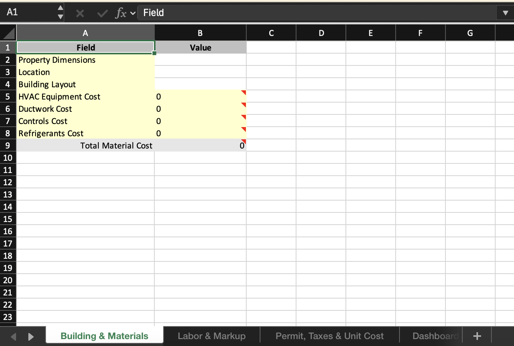
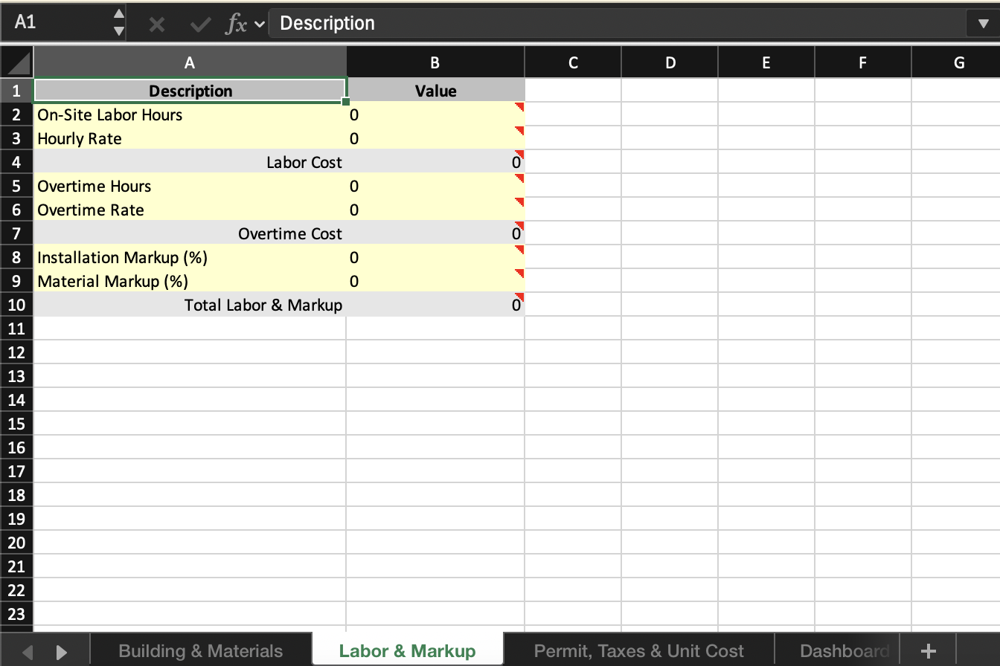
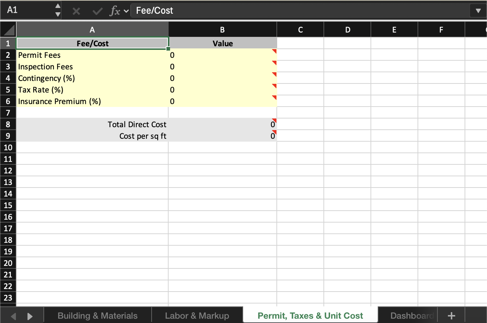
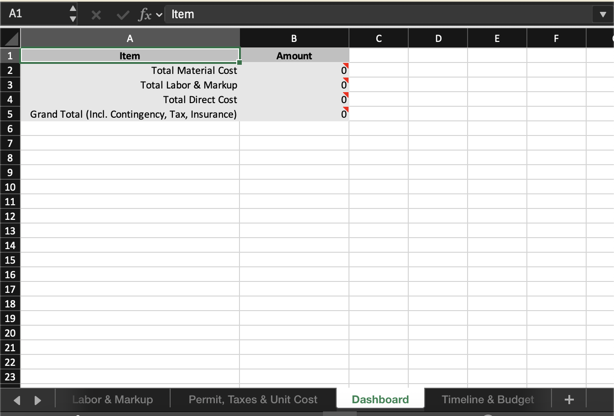
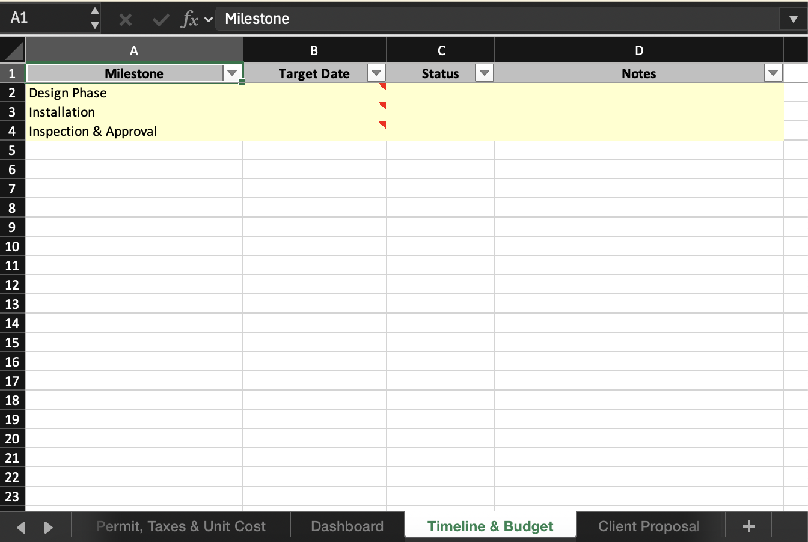
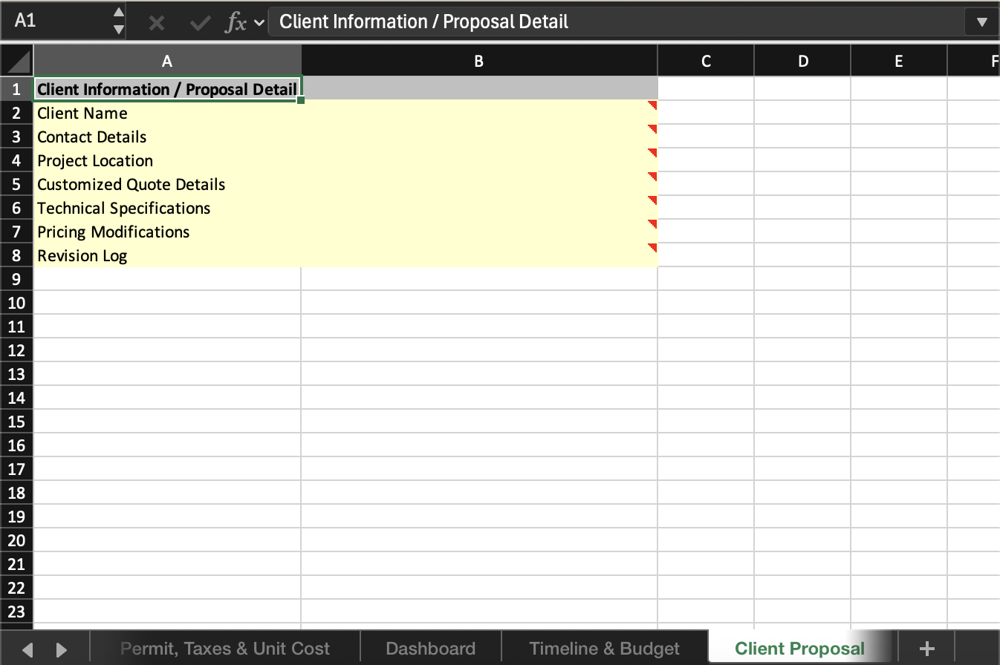
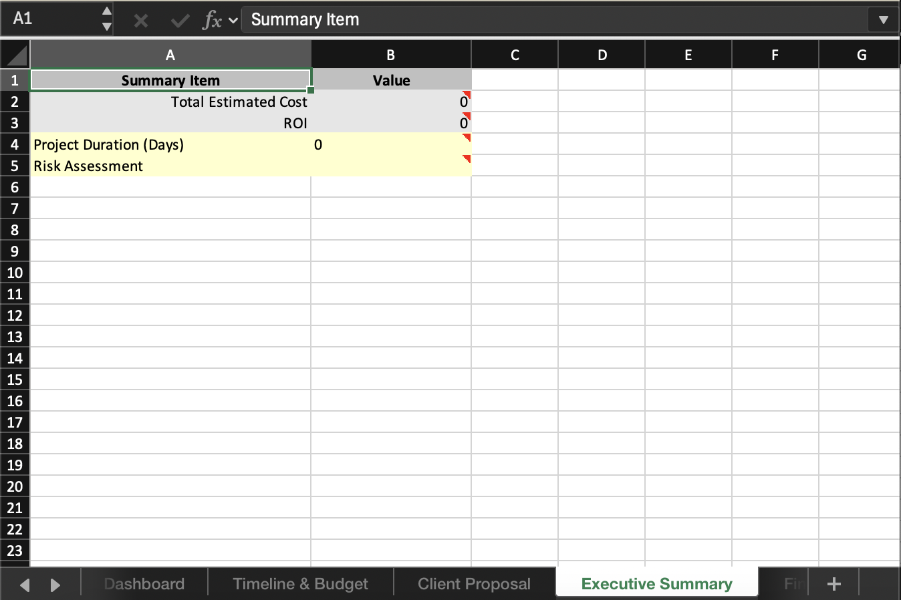
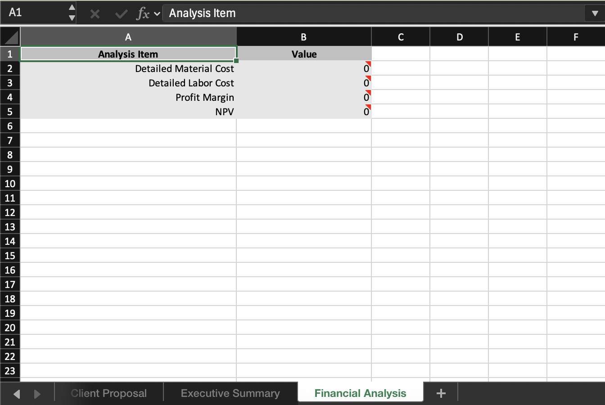

Approaching prompting from a domain, persona, and user context perspective.  Add some PEP as a step!

For awhile now, I’ve been using a technique that I have developed which I call __Persona Enriched Prompting__ ("PEP"). With this technique, you instruct the model to generate knowledge about the inferred domain and then generate UX personas for that domain contextual to the problem. Once this context is generated, only then do you continue on to final answer generation.

## Background

This all started for me when I needed to accept a customer prompt to generate an excel spreadsheet. It was an experiment at the time to see if AI could do a good job at this. While AI can’t generate an excel spreadsheet directly, it can generate the code that will produce a spreadsheet. So I created a basic app in under a day to see how well it performed. In short: not great. I found that I had preconceptions of what I wanted, but when I typed my request into my app, it was vague and underspecified. For example, one of the prompts I tried was “Make a budget spreadsheet for a medical office building”.

The root of the problem was that the context was lacking.  Why do I need a budget? Who will use it? In what scenarios will it apply? What data should be captured? Is the person asking it a doctor, a property manager, an office assistant?  All of these might have different requirements.

Strides have been made since late 2023 with chain-of-thought prompting.  In essence, in order to improve the outcome of a prompt, you instruct the model to “think step-by-step” before generating the output you require.  This will result in the model generating better instructions for itself, making the task more clear when the final answer is produced. This has shown success in improving outcomes for complex problems, and is the basis for “reasoning models” such as OpenAI’s “o” series, DeepSeek R1, and others. The difference being the reasoning models have been trained to use this technique without explicit prompting and have special token generation layers.

But while this technique is good, it is generalized and not always fit for your purpose in a highly contextual business specific task.  PEP further clarifies the task and improves outcomes for problems where the domain is not well understood ahead of time.

## Example

The following two contrasting outcomes are from the same prompt to generate an excel template. The request for both results is `I need an HVAC buildout quote template for a strip mall.`  The model used is `o1-mini` with effort set to `high` for maximum pseudoreasoning.

The difference between the two results is that the outcome without PEP took the user request directly as the specification, and the outcome with PEP first generated the domain, persona, and information needs, and then used those as the specification.

### Without PEP

The spreadsheet generated is highly generic, lacking detail, and is not useful to the end-user who initiated the request.


*Figure 1: The generic spreadsheet generated for the user request directly.*

### With PEP

Figures 2 through 9 are the different tabs of the same spreadsheet generated with PEP for the one request, each tab has contextual detail applicable to the inferred requirements.



*Figure 2: Building & Materials*



*Figure 3: Labor & Markup*



*Figure 4: Permit, Taxes, & Unit Cost*



*Figure 5: Dashboard*



*Figure 6: Timeline & Budget*



*Figure 7: Client Proposal*



*Figure 8: Executive Summary*



*Figure 9: Financial Analysis*

As you can see, PEP altered the outcome drastically, providing a much more useful and thorough spreadsheet.

## Why PEP works

My expertise lies in information retrieval (aka “search”), and I have worked on improving many many retrieval systems since I started this journey back in 2011.  One of the first things you learn when approaching search is that people type vague queries in search bars.  One of the first techniques you apply to improving outcomes is to map out information needs.  Info needs can (and usually should) be tied to a persona - an example customer profile that describes the motivations behind the search.  This helps us define ways to take the vagueness away from the query.  Let’s illustrate an example.  The query is: “patient injury”

Now what do you think that query means?  It could be lots of things.  So take into account where the query is found:

- Product: healthcare research platform
- Domain: regulatory compliance
- Persona: hospital counsel

The query is now far clearer in the context of the product, domain, and persona.  We have a scoped view of the type of content we should be providing to the person who wrote that vague query.

Therefore, by having the model construct potential contexts prior to answering, we can self-scope the request based on inferred context.  This will ultimately yield a better answer.

To recap: When a user query for a generative system or agent is vague, we have the model generate information needs and define a more detailed specification which will be used in addition to the original user query.  In effect, we generate assumptive requirements around what the user is asking for and use those requirements to bolster the prompt context.

## Pre-work

Identify the website or product or scenario for which the agent tool applies.  This can be broad (“generates an excel file”) or narrow (“an e-commerce website”).

Gather a comprehensive description about this domain context.  This yields the domain value.  The domain should be at least one paragraph, perhaps more.  It is the full high-level description of the system in place.

Importantly, the domain is either wholly provided by the designer of the system, or is obtained by acquiring primary source content and generating one using a custom RAG prompt.

   - Step 1: accept the query or user prompt
   - Step 2: Provide the domain and the query to a persona identification prompt template to yield persona. The persona is an expanded description of the UX scenario and background from which the user is approaching the tool being used.
   - Step 3: Provide the domain, persona, and query to the information need prompt template to yield specification.  The specification is the set of needs from the persona’s perspective on exactly what they are looking for, and why.  Consider this the fully expanded version of the original query, incorporating all the domain and persona details we have previously discovered.
   - Step 4: Execute the task!  Provide the domain, persona, query, and specification to generate the final result.  Previous to PEP, the original user query would have been provided here alone.

## Application

PEP is a general technique, and can be applied to any existing generative or agentic system as a feature expansion of the existing system.  Simply replace the basic generation from the original query with the pre-work and steps provided above.

As an implementation detail, each prompt template in all the steps is application specific.  You should craft these templates to derive the context values in each step to best fit your product and user goals.  For example, a set of prompt templates for automated relevance judgements will be very different than a set of prompt templates for excel document generation.

## Example Template and Schema

For the excel generator above, I used the following prompt and structure output json-schema to generate the specification.  This accepts the user `request` value (for example "*I need an HVAC buildout quote template for a strip mall.*") in a simple form field or chat, and renders the prompt before passing it to the LLM.

```markdown
# Excel Requirements Specification

You are an business analyst whose job it is to read a vague request for an excel spreadsheet and create a comprehensive specification. You are the best at this, because you are thorough, consistent, and always do more than needed. You are a self-starter and go above and beyond to deliver comprehensive, accurate, and reliable specifications. You will be given a vague request for a spreadsheet.

# Domain Driven Analysis

When writing the requirements, you need to think step-by-step on what the potential requirements must be. You do this by (1) describing the background/market/domain of the user request, (2) enumerating the personas and UX details for that domain, and then (3) describing all the possible fields, data, sheets as comprehensive requirements for an excel workbook catering to these personas. You are able to do this all by looking at a simple request for an excel workbook.

## Information Needs

Along with summarizing a domain and personas, you are also responsible researching how to fulfill the needs for personas that require the solution. Specifically, you are good at understanding and empathizing with a persona, and imagining why they would be using a spreadsheet to fulfill their information needs. You also understand that when users request a workbook, they are typically typing short and often requests in haste. You have a knack for enumerating through all the possible things someone would need, based on their inferred context, and creating the solution. It is your job to understand the domain and write as many possible requirements as would conceivably exist first, and then once you have written those requirements are you then to proceed writing the code.

## User Request

The following is the user request for the excel workbook

<%-request%>

# Instructions

 - Read the above carefully
 - Write the industry/market/domain description of the request
 - Write the list of personas and their details
 - Write the comprehensive excel specifications based on the personas information needs
```

This is the schema used in a structured output call for the above prompt:

```json
{
  "name": "excel_requirements",
  "description": "The comprehensive requirements for the excel workbook",
  "strict": true,
  "schema": {
    "type": "object",
    "properties": {
      "name": {"type":"string", "description": "The name of the workbook"},
      "domain": {"type": "string", "description": "The industry, market, domain, or context of the excel request and requirements"},
      "personas": {
        "description": "A list of 5 personas that are potential users of the excel workbook",
        "type": "array",
        "items" : {
          "type": "object",
          "properties": {
            "name":{"type":"string"},
            "background":{"type":"string"},
            "role":{"type":"string"},
            "responsibilities":{"type":"string"},
            "goals":{"type":"string"},
            "motivation":{"type":"string"},
            "pain_points":{"type":"string"},
            "requirements": {
              "description": "A comprehensive list of at least 10 unique requirements for this workbook that the persona needs.",
              "type": "array",
              "items" : {
                "type": "object",
                "properties": {
                  "requirement":{"type":"string"},
                  "implementation_details":{"type":"string"}
                },
                "required":["requirement","implementation_details"],
                "additionalProperties":false
              }
            }            
          },
          "required":["name","background","role","responsibilities","goals","motivation","pain_points","requirements"],
          "additionalProperties":false
        }
      }
    },
    "required":["name","domain","personas"],
    "additionalProperties":false
  }
}
```

The above template and schema were tailored specifically for the excel generator tool in the application context, but you can easily adapt them to your own needs.

*Note, that since I was using an o-series pseudoreasoning model, I do not need to explicitly request chain-of-thought as this is already covered by the model internals.*

## Challenges

While providing additional context and specifications to the LLM should increase outcomes for vague or ambiguous user queries, we need to be mindful of several potential problems: 

  1. PEP may in theory degrade performance for well-specified queries.
  2. Each individual prompt template will require tuning.  This increases the burden on evaluation.
  3. The law of compounding errors may work against us with under-tuned prompts or user query edge cases

## Mitigations of challenges

  1. In some applications, consider classifying user queries, and decide if PEP should be used.  For example, in excel generation, only use PEP for vastly underspecified or vague queries.  If a user query is comprehensive then bypass PEP and generate the final result with the user query verbatim.
  2. Perform steps to test outcomes of each prompt, and tune accordingly until satisfied. Consider using a system such as RAGAS or DSPy for this step.
  3. Improve evaluation coverage and evolve the prompts over time as new user queries are provided by customers.

## Conclusion

If you like this, please share it. Get in touch with me on [LinkedIn](https://www.linkedin.com/in/maxirwin/) if you are interested in discussing more, or if you'd like some help integrating these or other techniques into your products.