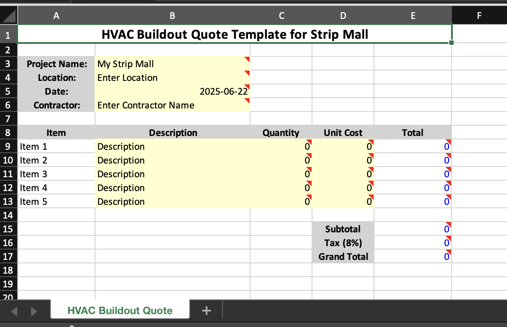
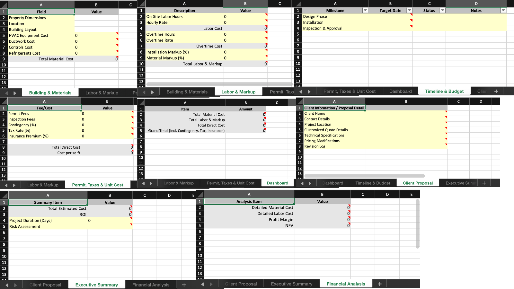
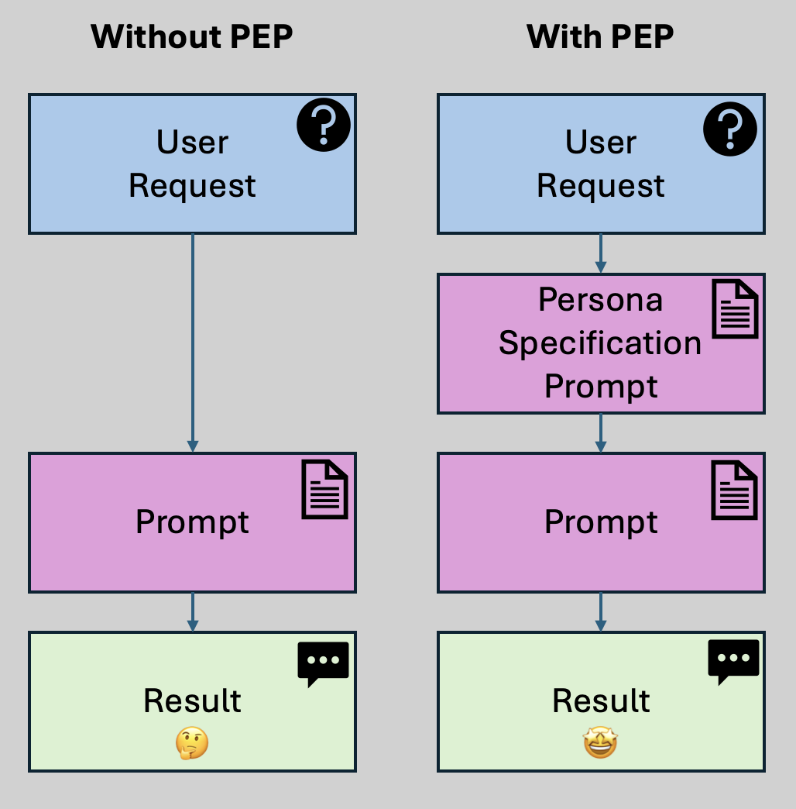
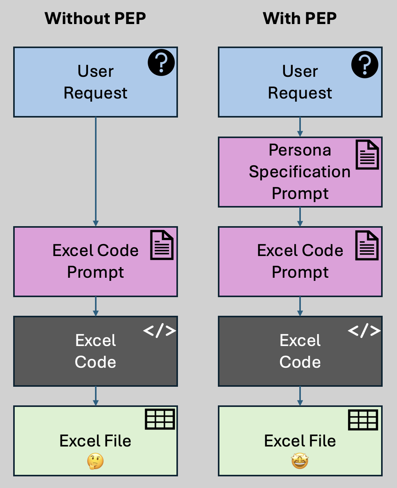

Approaching prompting from a domain, persona, and user context perspective.  Add some PEP as a step!

For awhile now, I’ve been using a technique that I have developed which I call __Persona Enriched Prompting__ ("PEP"). With this technique, you instruct the model to generate knowledge about the inferred domain and then generate UX personas for that domain contextual to the problem. Once this context is generated, only then do you continue on to final answer generation.

## Background

This all started for me when I needed to accept a customer prompt to generate an excel spreadsheet. It was an experiment at the time to see if AI could do a good job at this. While AI can’t generate an excel spreadsheet directly, it can generate the code that will produce a spreadsheet. So I created a basic app in under a day to see how well it performed. In short: not great. I found that I had preconceptions of what I wanted, but when I typed my request into my app, it was vague and underspecified. For example, one of the prompts I tried was “Make a budget spreadsheet for a medical office building”.

The root of the problem was that the context was lacking.  Why do I need a budget? Who will use it? In what scenarios will it apply? What data should be captured? Is the person asking it a doctor, a property manager, an office assistant?  All of these might have different requirements.

Strides have been made since late 2023 with chain-of-thought prompting.  In essence, in order to improve the outcome of a prompt, you instruct the model to “think step-by-step” before generating the output you require.  This will result in the model generating better instructions for itself, making the task more clear when the final answer is produced. This has shown success in improving outcomes for complex problems, and is the basis for “reasoning models” such as OpenAI’s “o” series, DeepSeek R1, and others. The difference being the reasoning models have been trained to use this technique without explicit prompting and have special token generation layers.

Additionally, while [pre-defined persona based prompting](https://www.youtube.com/watch?v=44--JTG0aMg) has shown success , this technique works well even if the personas are not identified beforehand.

## Example

The following two contrasting outcomes are from the same prompt to generate an excel template. The request for both results is *"I need an HVAC buildout quote template for a strip mall."*  The model used is `o1-mini` with effort set to `high` for maximum pseudoreasoning.

The difference between the two results is that the outcome without PEP took the user request directly as the specification, and the outcome with PEP first generated the domain, persona, and information needs, and then used those as the specification.

### Without PEP

The spreadsheet generated is highly generic, lacking detail, and is not useful to the end-user who initiated the request.

[](hvac-excel-without-pep.xlsx)

*Figure 1: The generic spreadsheet generated for the user request directly.*

There is just one tab, without much detail.

### With PEP

[](hvac-excel-with-pep.xlsx)

*Figure 2 shows all the different tabs of the same spreadsheet generated with PEP for the one request, each tab has contextual detail applicable to the inferred requirements.*

The tabs generated are:

 - Building & Materials
 - Labor & Markup
 - Permit, Taxes, & Unit Cost
 - Dashboard
 - Timeline & Budget
 - Client Proposal
 - Executive Summary
 - Financial Analysis

As you can see, PEP altered the outcome drastically, providing a much more useful and thorough spreadsheet.

*You can download both spreadsheets to compare by clicking on the images*

## Why PEP works

My expertise lies in information retrieval (aka “search”), and I have worked on improving many many retrieval systems since I started this journey back in 2011.  One of the first things you learn when approaching search is that people type vague queries in search bars.  One of the first techniques you apply to improving outcomes is to map out information needs.  Info needs can (and usually should) be tied to a persona - an example customer profile that describes the motivations behind the search.  This helps us define ways to take the vagueness away from the query.  Let’s illustrate an example.  The query is: “patient injury”

Now what do you think that query means?  It could be lots of things.  So take into account where the query is found:

- Product: healthcare research platform
- Domain: regulatory compliance
- Persona: hospital counsel

The query is now far clearer in the context of the product, domain, and persona.  We have a scoped view of the type of content we should be providing to the person who wrote that vague query.

Therefore, by having the model construct potential contexts prior to answering, we can self-scope the request based on inferred context.  This will ultimately yield a better answer.

To recap: When a user query for a generative system or agent is vague, we have the model generate information needs and define a more detailed specification which will be used in addition to the original user query.  In effect, we generate assumptive requirements around what the user is asking for and use those requirements to bolster the prompt context.

## Pre-work

Identify the website or product or scenario for which the agent tool applies.  This can be broad (“generates an excel file”) or narrow (“an e-commerce website”).

Gather a comprehensive description about this domain context.  This yields the domain value.  The domain should be at least one paragraph, perhaps more.  It is the full high-level description of the system in place.

Importantly, the domain is either wholly provided by the designer of the system, or is obtained by acquiring primary source content and generating one using a custom RAG prompt.

   - Step 1: accept the query or user prompt
   - Step 2: Provide the domain and the query to a persona identification prompt template to yield persona. The persona is an expanded description of the UX scenario and background from which the user is approaching the tool being used.
   - Step 3: Provide the domain, persona, and query to the information need prompt template to yield specification.  The specification is the set of needs from the persona’s perspective on exactly what they are looking for, and why.  Consider this the fully expanded version of the original query, incorporating all the domain and persona details we have previously discovered.
   - Step 4: Execute the task!  Provide the domain, persona, query, and specification to generate the final result.  Previous to PEP, the original user query would have been provided here alone.

## Application

PEP is a general technique, and can be applied to any existing generative or agentic system as a feature expansion of the existing system.  Simply replace the basic generation from the original query with the pre-work and steps provided above.



As an implementation detail, each prompt template in all the steps is application specific.  You should craft these templates to derive the context values in each step to best fit your product and user goals.  For example, a set of prompt templates for automated relevance judgements will be very different than a set of prompt templates for excel document generation. 

## Example Template and Schema

For the excel generator above, I used the following prompt and structure output json-schema to generate the specification.  This accepts the user `request` value (for example "*I need an HVAC buildout quote template for a strip mall.*") in a simple form field or chat, and renders the prompt before passing it to the LLM.

<div class="markdown-prompt">
<strong># Excel Requirements Specification</strong>

You are an business analyst whose job it is to read a vague request for an excel spreadsheet and create a comprehensive specification. You are the best at this, because you are thorough, consistent, and always do more than needed. You are a self-starter and go above and beyond to deliver comprehensive, accurate, and reliable specifications. You will be given a vague request for a spreadsheet.

<strong># Domain Driven Analysis</strong>

When writing the requirements, you need to think step-by-step on what the potential requirements must be. You do this by (1) describing the background/market/domain of the user request, (2) enumerating the personas and UX details for that domain, and then (3) describing all the possible fields, data, sheets as comprehensive requirements for an excel workbook catering to these personas. You are able to do this all by looking at a simple request for an excel workbook.

<strong>## Information Needs</strong>

Along with summarizing a domain and personas, you are also responsible researching how to fulfill the needs for personas that require the solution. Specifically, you are good at understanding and empathizing with a persona, and imagining why they would be using a spreadsheet to fulfill their information needs. You also understand that when users request a workbook, they are typically typing short and often requests in haste. You have a knack for enumerating through all the possible things someone would need, based on their inferred context, and creating the solution. It is your job to understand the domain and write as many possible requirements as would conceivably exist first, and then once you have written those requirements are you then to proceed writing the code.

<strong>## User Request</strong>

The following is the user request for the excel workbook

&lt;%-request%&gt;

<strong># Instructions</strong>

 <br>- Read the above carefully
 <br>- Write the industry/market/domain description of the request
 <br>- Write the list of personas and their details
 <br>- Write the comprehensive excel specifications based on the personas information needs
</div>

This is the schema used in a structured output call for the above prompt:

```json
{
  "name": "excel_requirements",
  "description": "The comprehensive requirements for the excel workbook",
  "strict": true,
  "schema": {
    "type": "object",
    "properties": {
      "name": {"type":"string", "description": "The name of the workbook"},
      "domain": {"type": "string", "description": "The industry, market, domain, or context of the excel request and requirements"},
      "personas": {
        "description": "A list of 5 personas that are potential users of the excel workbook",
        "type": "array",
        "items" : {
          "type": "object",
          "properties": {
            "name":{"type":"string"},
            "background":{"type":"string"},
            "role":{"type":"string"},
            "responsibilities":{"type":"string"},
            "goals":{"type":"string"},
            "motivation":{"type":"string"},
            "pain_points":{"type":"string"},
            "requirements": {
              "description": "A comprehensive list of at least 10 unique requirements for this workbook that the persona needs.",
              "type": "array",
              "items" : {
                "type": "object",
                "properties": {
                  "requirement":{"type":"string"},
                  "implementation_details":{"type":"string"}
                },
                "required":["requirement","implementation_details"],
                "additionalProperties":false
              }
            }            
          },
          "required":["name","background","role","responsibilities","goals","motivation","pain_points","requirements"],
          "additionalProperties":false
        }
      }
    },
    "required":["name","domain","personas"],
    "additionalProperties":false
  }
}
```

The above template and schema were tailored specifically for the excel generator tool in the application context, but you can easily adapt them to your own needs.

*Note, that since I was using an o-series pseudoreasoning model, I do not need to explicitly request chain-of-thought as this is already covered by the model internals.*

### Example output

This is the output example using the the above templates for the user query "*I need an HVAC buildout quote template for a strip mall.*"

<!--
```json
{
  "name": "HVAC Buildout Quote Template for Strip Mall",
  "domain": "Construction/Commercial HVAC | This template is designed for creating detailed buildout quotes for HVAC systems in strip malls. It encompasses comprehensive cost estimations including labor, materials, permits, equipment, and inspections required for the setup, and provides interactive tools to support detailed financial analysis and project management.",
  "personas": [
    {
      "name": "HVAC Estimator",
      "background": "An experienced HVAC professional specializing in cost estimation and technical planning.",
      "role": "Cost Estimator",
      "responsibilities": "Accurately calculate detailed costs for both materials and labor, and ensure all technical specifications are met in line with project requirements.",
      "goals": "Deliver highly accurate estimates that reflect all cost variables to secure profitable project bids.",
      "motivation": "Efficient and accurate quoting minimizes rework and enhances competitiveness in bidding processes.",
      "pain_points": "Struggles with consolidating various cost data, potential oversight of hidden costs, and keeping estimations up-to-date with market price changes.",
      "requirements": [
        {
          "requirement": "Building Information Sheet",
          "implementation_details": "Include fields for property dimensions, location specifics, and building layout details to inform overall project requirements."
        },
        {
          "requirement": "Material Cost Breakdown",
          "implementation_details": "Separate sections for HVAC equipment, ductwork, controls, and refrigerants with dynamic lookup tables for material prices."
        },
        {
          "requirement": "Labor Cost Estimator",
          "implementation_details": "Calculation modules for on-site labor costs, installation durations, and overtime rates, integrating local wage data."
        },
        {
          "requirement": "Installation & Equipment Markup",
          "implementation_details": "Fields to apply adjustable percentage markups on labor and material costs with real-time calculation updates."
        },
        {
          "requirement": "Permit and Inspection Fees",
          "implementation_details": "Dedicated fields to input and calculate municipal permitting, inspection, and licensing fees."
        },
        {
          "requirement": "Contingency Reserve Calculation",
          "implementation_details": "Section that allows entry of a contingency percentage to cover unforeseen expenses based on project size."
        },
        {
          "requirement": "Tax and Insurance Calculations",
          "implementation_details": "Automatic formulas for computing local taxes and insurance premiums related to the buildout."
        },
        {
          "requirement": "Unit Cost Analysis",
          "implementation_details": "Breakdowns of costs per unit (e.g., per square foot or per duct length) to assist with scalability of estimates."
        },
        {
          "requirement": "Dynamic Cost Summary Dashboard",
          "implementation_details": "Interactive charts and summary tables that update automatically to reflect changes in cost inputs."
        },
        {
          "requirement": "Historical Data Reference",
          "implementation_details": "Section for comparing current estimates with past project data to improve forecast accuracy."
        }
      ]
    },
    {
      "name": "Project Manager",
      "background": "An experienced professional in overseeing large-scale construction and HVAC projects ensuring timelines and budgets are met.",
      "role": "Project Manager",
      "responsibilities": "Coordinate project timelines, budgets, and resources while maintaining communication between stakeholders and ensuring compliance with established milestones.",
      "goals": "Maintain projects on schedule and within budget while effectively managing and mitigating risks.",
      "motivation": "Efficient project tracking and budgeting ensure smoother project execution and higher stakeholder satisfaction.",
      "pain_points": "Difficulty in tracking simultaneous cost updates, managing change orders, and integrating various data sources into coherent progress reports.",
      "requirements": [
        {
          "requirement": "Timeline & Milestone Tracker",
          "implementation_details": "A dedicated sheet to capture project phases, key dates, milestones, and task dependencies with automated date alerts."
        },
        {
          "requirement": "Budget Overview Summary",
          "implementation_details": "An aggregated dashboard that provides a consolidated view of all cost components and compares actual versus planned budgets."
        },
        {
          "requirement": "Vendor and Supplier Database",
          "implementation_details": "A section to store and track vendor details, contact information, and contractual terms for easy reference."
        },
        {
          "requirement": "Change Order Log",
          "implementation_details": "A log that captures every change request along with cost implications and approval statuses."
        },
        {
          "requirement": "Risk and Issue Register",
          "implementation_details": "A register to record potential risks, current issues, impact assessments, and mitigation plans."
        },
        {
          "requirement": "Interactive Project Status Dashboard",
          "implementation_details": "Visual summaries with charts showing progress, cost burn rate, and schedule adherence updated in real-time."
        },
        {
          "requirement": "Resource Allocation Table",
          "implementation_details": "A detailed grid to assign labor, track man-hours and monitor subcontractor engagements."
        },
        {
          "requirement": "Reporting and Export Features",
          "implementation_details": "Preformatted report templates that can be exported as PDF or printed for stakeholder update meetings."
        },
        {
          "requirement": "Milestone Cost Tracking",
          "implementation_details": "Link specific budget entries to project milestones to track expenditure distribution over time."
        },
        {
          "requirement": "What-if Scenario Simulation",
          "implementation_details": "Tool to simulate changes in cost or schedule variables to assess potential project impacts."
        }
      ]
    },
    {
      "name": "Sales Engineer",
      "background": "Technically proficient with a strong sales orientation, adept at communicating product value and technical details to clients.",
      "role": "Sales Engineer",
      "responsibilities": "Develop persuasive and client-customized quotes that align technical specifications with clear financial breakdowns.",
      "goals": "Convert leads into contracts by providing clear, detailed, and client-friendly HVAC buildout quotes.",
      "motivation": "Enhanced ability to tailor quotes to client needs drives higher conversion rates and customer satisfaction.",
      "pain_points": "Balancing the level of technical detail with ease of understanding for clients and rapidly adjusting pricing during negotiations.",
      "requirements": [
        {
          "requirement": "Client Information Section",
          "implementation_details": "Fields to capture client name, contact details, project location, and specific client requirements for personalized quoting."
        },
        {
          "requirement": "Quote Customization Options",
          "implementation_details": "Features that allow adding company branding elements, adjustable color schemes, and formatting options for client presentations."
        },
        {
          "requirement": "Technical Specifications Sheet",
          "implementation_details": "A detailed section outlining technical requirements, system specifications, and compliance standards."
        },
        {
          "requirement": "Pricing Modification Module",
          "implementation_details": "Interactive fields that allow on-the-fly adjustments of labor and material costs to reflect negotiated discounts or value-adds."
        },
        {
          "requirement": "Interactive Quoting Tool",
          "implementation_details": "Real-time calculator that updates quotes as clients choose different options and configurations."
        },
        {
          "requirement": "Standardized Proposal Format",
          "implementation_details": "A pre-designed layout that integrates detailed quotes with professional design for ease of printing or digital delivery."
        },
        {
          "requirement": "Alternative Proposal Templates",
          "implementation_details": "Ability to generate multiple versions of quotes that highlight different configurations or cost-saving options."
        },
        {
          "requirement": "Revision and Commentary Log",
          "implementation_details": "A section for tracking revisions, client feedback, and internal notes to maintain a history of changes."
        },
        {
          "requirement": "Pricing Assumptions Documentation",
          "implementation_details": "Fields to document assumptions behind cost estimates, including labor rates, material prices, and market factors."
        },
        {
          "requirement": "Visual Cost Distribution Charts",
          "implementation_details": "Integrated charts and graphs that visually represent the cost breakdown and highlight key pricing drivers."
        }
      ]
    },
    {
      "name": "Business Owner / Developer",
      "background": "Senior decision-maker responsible for overall project feasibility, strategic investments, and final approvals.",
      "role": "Business Owner / Developer",
      "responsibilities": "Evaluate the financial and operational viability of projects, monitor overall project expenditures, and make high-level strategic decisions.",
      "goals": "Quickly assess project viability through clear, summarized financial information and strategic risk insights.",
      "motivation": "Clear, consolidated data allows for faster, more informed decision-making which can lead to improved project outcomes.",
      "pain_points": "Overly technical details can be overwhelming, and inconsistent summary data may lead to decision delays.",
      "requirements": [
        {
          "requirement": "Executive Summary Sheet",
          "implementation_details": "A one-page comprehensive overview covering total estimated costs, ROI, project duration and risk assessments."
        },
        {
          "requirement": "Integrated Financial Dashboard",
          "implementation_details": "Visual dashboard with key metrics such as total cost, cost breakdown, margins, and profitability analysis."
        },
        {
          "requirement": "Cost Category Breakdown",
          "implementation_details": "Distinct visualization of labor, material, permit, and contingency costs for rapid assessment."
        },
        {
          "requirement": "ROI and Profitability Calculator",
          "implementation_details": "Interactive tool to calculate profit margins, return on investment and breakeven analysis based on current estimates."
        },
        {
          "requirement": "Historical Comparison Feature",
          "implementation_details": "Option to compare current estimates with historical projects to evaluate pricing trends and performance."
        },
        {
          "requirement": "Risk Assessment Overview",
          "implementation_details": "A dedicated section summarizing potential project risks alongside mitigation strategies and financial impact."
        },
        {
          "requirement": "Exportable Reports",
          "implementation_details": "Ability to export high-level dashboards and summaries into PDF or other presentation formats for board meetings."
        },
        {
          "requirement": "Scenario Analysis Tools",
          "implementation_details": "Modules that allow tweaking of key parameters (like markups and contingencies) to forecast different financial outcomes."
        },
        {
          "requirement": "User-Friendly Navigation",
          "implementation_details": "Intuitive tab-based layout with clear labeling for quick navigation across detailed and summary sheets."
        },
        {
          "requirement": "Automated Alert System",
          "implementation_details": "Conditional formatting and notifications for cost deviations or significant changes in project estimates."
        }
      ]
    },
    {
      "name": "Financial Analyst",
      "background": "Specializes in detailed financial modeling, forecasting, and performing sensitivity analyses for cost-efficiency and profitability.",
      "role": "Financial Analyst",
      "responsibilities": "Analyze detailed cost data, prepare financial projections, and provide insights on cost drivers and overall project viability.",
      "goals": "Ensure the project’s financial viability by presenting data-backed forecasts and performing in-depth cost analyses.",
      "motivation": "Accurate models and detailed breakdowns allow for precise financial forecasting and risk-adjusted decision making, optimizing investment returns.",
      "pain_points": "Inconsistencies in data and a lack of integrated financial models hinder comprehensive financial analysis leading to forecasting errors.",
      "requirements": [
        {
          "requirement": "Detailed Cost Analysis Sheet",
          "implementation_details": "Section dedicated to drilling down into individual cost components with detailed formulas and breakdowns."
        },
        {
          "requirement": "What-if Scenario Analysis",
          "implementation_details": "Interactive module to test different variables such as cost increases, labor fluctuations, and delays to forecast financial impacts."
        },
        {
          "requirement": "Historical Data Integration",
          "implementation_details": "Import and compare past project data with current estimates to identify trends and validate assumptions."
        },
        {
          "requirement": "Dynamic Cost Update Mechanism",
          "implementation_details": "Linked formula system that updates cost components across all sheets when input data is modified."
        },
        {
          "requirement": "Profit Margin and NPV Calculations",
          "implementation_details": "Modules to compute profit margins, net present value, and other financial metrics based on input assumptions."
        },
        {
          "requirement": "Sensitivity Analysis Reports",
          "implementation_details": "Preformatted reports that identify which variables have the highest impact on overall project costs."
        },
        {
          "requirement": "Graphical Data Visualization",
          "implementation_details": "Integrated charts and graphs such as line graphs, bar charts, and pie charts to visualize spending trends and cost distributions."
        },
        {
          "requirement": "Data Import/Export Functionality",
          "implementation_details": "Allow users to seamlessly import external data sets and export processed data for further analysis."
        },
        {
          "requirement": "Customizable Cost Categories",
          "implementation_details": "Fields that allow the addition or modification of cost categories in line with evolving project needs."
        },
        {
          "requirement": "Audit Trail for Data Changes",
          "implementation_details": "Implement a logging feature that records and timestamps changes in key financial figures for accuracy and compliance."
        }
      ]
    }
  ],
  "request": "I need an HVAC buildout quote template for a strip mall."
}
```
-->

<div id="personacards" style="font-size:0.8rem;border:1px solid #000;padding:5px;"></div>
<script>
   (function(){
      var data = {
        "name": "HVAC Buildout Quote Template for Strip Mall",
        "domain": "Construction/Commercial HVAC | This template is designed for creating detailed buildout quotes for HVAC systems in strip malls. It encompasses comprehensive cost estimations including labor, materials, permits, equipment, and inspections required for the setup, and provides interactive tools to support detailed financial analysis and project management.",
        "personas": [
          {
            "name": "HVAC Estimator",
            "background": "An experienced HVAC professional specializing in cost estimation and technical planning.",
            "role": "Cost Estimator",
            "responsibilities": "Accurately calculate detailed costs for both materials and labor, and ensure all technical specifications are met in line with project requirements.",
            "goals": "Deliver highly accurate estimates that reflect all cost variables to secure profitable project bids.",
            "motivation": "Efficient and accurate quoting minimizes rework and enhances competitiveness in bidding processes.",
            "pain_points": "Struggles with consolidating various cost data, potential oversight of hidden costs, and keeping estimations up-to-date with market price changes.",
            "requirements": [
              {
                "requirement": "Building Information Sheet",
                "implementation_details": "Include fields for property dimensions, location specifics, and building layout details to inform overall project requirements."
              },
              {
                "requirement": "Material Cost Breakdown",
                "implementation_details": "Separate sections for HVAC equipment, ductwork, controls, and refrigerants with dynamic lookup tables for material prices."
              },
              {
                "requirement": "Labor Cost Estimator",
                "implementation_details": "Calculation modules for on-site labor costs, installation durations, and overtime rates, integrating local wage data."
              },
              {
                "requirement": "Installation & Equipment Markup",
                "implementation_details": "Fields to apply adjustable percentage markups on labor and material costs with real-time calculation updates."
              },
              {
                "requirement": "Permit and Inspection Fees",
                "implementation_details": "Dedicated fields to input and calculate municipal permitting, inspection, and licensing fees."
              },
              {
                "requirement": "Contingency Reserve Calculation",
                "implementation_details": "Section that allows entry of a contingency percentage to cover unforeseen expenses based on project size."
              },
              {
                "requirement": "Tax and Insurance Calculations",
                "implementation_details": "Automatic formulas for computing local taxes and insurance premiums related to the buildout."
              },
              {
                "requirement": "Unit Cost Analysis",
                "implementation_details": "Breakdowns of costs per unit (e.g., per square foot or per duct length) to assist with scalability of estimates."
              },
              {
                "requirement": "Dynamic Cost Summary Dashboard",
                "implementation_details": "Interactive charts and summary tables that update automatically to reflect changes in cost inputs."
              },
              {
                "requirement": "Historical Data Reference",
                "implementation_details": "Section for comparing current estimates with past project data to improve forecast accuracy."
              }
            ]
          },
          {
            "name": "Project Manager",
            "background": "An experienced professional in overseeing large-scale construction and HVAC projects ensuring timelines and budgets are met.",
            "role": "Project Manager",
            "responsibilities": "Coordinate project timelines, budgets, and resources while maintaining communication between stakeholders and ensuring compliance with established milestones.",
            "goals": "Maintain projects on schedule and within budget while effectively managing and mitigating risks.",
            "motivation": "Efficient project tracking and budgeting ensure smoother project execution and higher stakeholder satisfaction.",
            "pain_points": "Difficulty in tracking simultaneous cost updates, managing change orders, and integrating various data sources into coherent progress reports.",
            "requirements": [
              {
                "requirement": "Timeline & Milestone Tracker",
                "implementation_details": "A dedicated sheet to capture project phases, key dates, milestones, and task dependencies with automated date alerts."
              },
              {
                "requirement": "Budget Overview Summary",
                "implementation_details": "An aggregated dashboard that provides a consolidated view of all cost components and compares actual versus planned budgets."
              },
              {
                "requirement": "Vendor and Supplier Database",
                "implementation_details": "A section to store and track vendor details, contact information, and contractual terms for easy reference."
              },
              {
                "requirement": "Change Order Log",
                "implementation_details": "A log that captures every change request along with cost implications and approval statuses."
              },
              {
                "requirement": "Risk and Issue Register",
                "implementation_details": "A register to record potential risks, current issues, impact assessments, and mitigation plans."
              },
              {
                "requirement": "Interactive Project Status Dashboard",
                "implementation_details": "Visual summaries with charts showing progress, cost burn rate, and schedule adherence updated in real-time."
              },
              {
                "requirement": "Resource Allocation Table",
                "implementation_details": "A detailed grid to assign labor, track man-hours and monitor subcontractor engagements."
              },
              {
                "requirement": "Reporting and Export Features",
                "implementation_details": "Preformatted report templates that can be exported as PDF or printed for stakeholder update meetings."
              },
              {
                "requirement": "Milestone Cost Tracking",
                "implementation_details": "Link specific budget entries to project milestones to track expenditure distribution over time."
              },
              {
                "requirement": "What-if Scenario Simulation",
                "implementation_details": "Tool to simulate changes in cost or schedule variables to assess potential project impacts."
              }
            ]
          },
          {
            "name": "Sales Engineer",
            "background": "Technically proficient with a strong sales orientation, adept at communicating product value and technical details to clients.",
            "role": "Sales Engineer",
            "responsibilities": "Develop persuasive and client-customized quotes that align technical specifications with clear financial breakdowns.",
            "goals": "Convert leads into contracts by providing clear, detailed, and client-friendly HVAC buildout quotes.",
            "motivation": "Enhanced ability to tailor quotes to client needs drives higher conversion rates and customer satisfaction.",
            "pain_points": "Balancing the level of technical detail with ease of understanding for clients and rapidly adjusting pricing during negotiations.",
            "requirements": [
              {
                "requirement": "Client Information Section",
                "implementation_details": "Fields to capture client name, contact details, project location, and specific client requirements for personalized quoting."
              },
              {
                "requirement": "Quote Customization Options",
                "implementation_details": "Features that allow adding company branding elements, adjustable color schemes, and formatting options for client presentations."
              },
              {
                "requirement": "Technical Specifications Sheet",
                "implementation_details": "A detailed section outlining technical requirements, system specifications, and compliance standards."
              },
              {
                "requirement": "Pricing Modification Module",
                "implementation_details": "Interactive fields that allow on-the-fly adjustments of labor and material costs to reflect negotiated discounts or value-adds."
              },
              {
                "requirement": "Interactive Quoting Tool",
                "implementation_details": "Real-time calculator that updates quotes as clients choose different options and configurations."
              },
              {
                "requirement": "Standardized Proposal Format",
                "implementation_details": "A pre-designed layout that integrates detailed quotes with professional design for ease of printing or digital delivery."
              },
              {
                "requirement": "Alternative Proposal Templates",
                "implementation_details": "Ability to generate multiple versions of quotes that highlight different configurations or cost-saving options."
              },
              {
                "requirement": "Revision and Commentary Log",
                "implementation_details": "A section for tracking revisions, client feedback, and internal notes to maintain a history of changes."
              },
              {
                "requirement": "Pricing Assumptions Documentation",
                "implementation_details": "Fields to document assumptions behind cost estimates, including labor rates, material prices, and market factors."
              },
              {
                "requirement": "Visual Cost Distribution Charts",
                "implementation_details": "Integrated charts and graphs that visually represent the cost breakdown and highlight key pricing drivers."
              }
            ]
          },
          {
            "name": "Business Owner / Developer",
            "background": "Senior decision-maker responsible for overall project feasibility, strategic investments, and final approvals.",
            "role": "Business Owner / Developer",
            "responsibilities": "Evaluate the financial and operational viability of projects, monitor overall project expenditures, and make high-level strategic decisions.",
            "goals": "Quickly assess project viability through clear, summarized financial information and strategic risk insights.",
            "motivation": "Clear, consolidated data allows for faster, more informed decision-making which can lead to improved project outcomes.",
            "pain_points": "Overly technical details can be overwhelming, and inconsistent summary data may lead to decision delays.",
            "requirements": [
              {
                "requirement": "Executive Summary Sheet",
                "implementation_details": "A one-page comprehensive overview covering total estimated costs, ROI, project duration and risk assessments."
              },
              {
                "requirement": "Integrated Financial Dashboard",
                "implementation_details": "Visual dashboard with key metrics such as total cost, cost breakdown, margins, and profitability analysis."
              },
              {
                "requirement": "Cost Category Breakdown",
                "implementation_details": "Distinct visualization of labor, material, permit, and contingency costs for rapid assessment."
              },
              {
                "requirement": "ROI and Profitability Calculator",
                "implementation_details": "Interactive tool to calculate profit margins, return on investment and breakeven analysis based on current estimates."
              },
              {
                "requirement": "Historical Comparison Feature",
                "implementation_details": "Option to compare current estimates with historical projects to evaluate pricing trends and performance."
              },
              {
                "requirement": "Risk Assessment Overview",
                "implementation_details": "A dedicated section summarizing potential project risks alongside mitigation strategies and financial impact."
              },
              {
                "requirement": "Exportable Reports",
                "implementation_details": "Ability to export high-level dashboards and summaries into PDF or other presentation formats for board meetings."
              },
              {
                "requirement": "Scenario Analysis Tools",
                "implementation_details": "Modules that allow tweaking of key parameters (like markups and contingencies) to forecast different financial outcomes."
              },
              {
                "requirement": "User-Friendly Navigation",
                "implementation_details": "Intuitive tab-based layout with clear labeling for quick navigation across detailed and summary sheets."
              },
              {
                "requirement": "Automated Alert System",
                "implementation_details": "Conditional formatting and notifications for cost deviations or significant changes in project estimates."
              }
            ]
          },
          {
            "name": "Financial Analyst",
            "background": "Specializes in detailed financial modeling, forecasting, and performing sensitivity analyses for cost-efficiency and profitability.",
            "role": "Financial Analyst",
            "responsibilities": "Analyze detailed cost data, prepare financial projections, and provide insights on cost drivers and overall project viability.",
            "goals": "Ensure the project’s financial viability by presenting data-backed forecasts and performing in-depth cost analyses.",
            "motivation": "Accurate models and detailed breakdowns allow for precise financial forecasting and risk-adjusted decision making, optimizing investment returns.",
            "pain_points": "Inconsistencies in data and a lack of integrated financial models hinder comprehensive financial analysis leading to forecasting errors.",
            "requirements": [
              {
                "requirement": "Detailed Cost Analysis Sheet",
                "implementation_details": "Section dedicated to drilling down into individual cost components with detailed formulas and breakdowns."
              },
              {
                "requirement": "What-if Scenario Analysis",
                "implementation_details": "Interactive module to test different variables such as cost increases, labor fluctuations, and delays to forecast financial impacts."
              },
              {
                "requirement": "Historical Data Integration",
                "implementation_details": "Import and compare past project data with current estimates to identify trends and validate assumptions."
              },
              {
                "requirement": "Dynamic Cost Update Mechanism",
                "implementation_details": "Linked formula system that updates cost components across all sheets when input data is modified."
              },
              {
                "requirement": "Profit Margin and NPV Calculations",
                "implementation_details": "Modules to compute profit margins, net present value, and other financial metrics based on input assumptions."
              },
              {
                "requirement": "Sensitivity Analysis Reports",
                "implementation_details": "Preformatted reports that identify which variables have the highest impact on overall project costs."
              },
              {
                "requirement": "Graphical Data Visualization",
                "implementation_details": "Integrated charts and graphs such as line graphs, bar charts, and pie charts to visualize spending trends and cost distributions."
              },
              {
                "requirement": "Data Import/Export Functionality",
                "implementation_details": "Allow users to seamlessly import external data sets and export processed data for further analysis."
              },
              {
                "requirement": "Customizable Cost Categories",
                "implementation_details": "Fields that allow the addition or modification of cost categories in line with evolving project needs."
              },
              {
                "requirement": "Audit Trail for Data Changes",
                "implementation_details": "Implement a logging feature that records and timestamps changes in key financial figures for accuracy and compliance."
              }
            ]
          }
        ],
        "request": "I need an HVAC buildout quote template for a strip mall."
      };
      var cards = data.personas.map(p=>{
         var pr = p.requirements.map(r=>`<li><strong>${r.requirement}:</strong> ${r.implementation_details}</li>`).join('\n');
         return `
            <div style="border:1px solid black;margin:10px;padding:10px;background-color:rgba(0,0,0,0.05);">
            <h3>${p.name}</h3>
               <p><strong>background:</strong><br/>${p.background}</p>
               <p><strong>responsibilities:</strong><br/>${p.responsibilities}</p>
               <p><strong>goals:</strong><br/>${p.goals}</p>
               <p><strong>motivation:</strong><br/>${p.motivation}</p>
               <p><strong>pain_points:</strong><br/>${p.pain_points}</p>
               <h4>Requirements</h4>
               <ul>${pr}</ul>
            </div>
         `
      }).join('\n');
      var output = `
         <h1>${data.name}</h1>
         <p><strong>Domain:</strong><br/>${data.domain}</p>
         <div>
         <h2>Personas and their Requirements</h2>
         ${cards}
         </div>
      `
      document.getElementById("personacards").innerHTML = output;
   })();
</script>

The output is thorough and, while exhibiting signs of AI-ness, still managages to significantly reinforce the request and improve the outcome.

Here's how the above would be used, with a modified PEP workflow, tailored to an excel generator application.



Adoption is straightforward for existing systems and will improve outcomes for vague requests.

## Challenges

While providing additional context and specifications to the LLM should increase outcomes for vague or ambiguous user queries, we need to be mindful of several potential problems: 

  1. PEP may in theory degrade performance for well-specified queries.
  2. Each individual prompt template will require tuning.  This increases the burden on evaluation.
  3. The law of compounding errors may work against us with under-tuned prompts or user query edge cases

## Mitigations of challenges

  1. In some applications, consider classifying user queries, and decide if PEP should be used.  For example, in excel generation, only use PEP for vastly underspecified or vague queries.  If a user query is comprehensive then bypass PEP and generate the final result with the user query verbatim.
  2. Perform steps to test outcomes of each prompt, and tune accordingly until satisfied. Consider using a system such as RAGAS or DSPy for this step.
  3. Improve evaluation coverage and evolve the prompts over time as new user queries are provided by customers.

## Conclusion

If you like this, please [share it](https://www.linkedin.com/feed/update/urn:li:activity:7342927405960916994/)! Get in touch with me on [LinkedIn](https://www.linkedin.com/in/maxirwin/) if you are interested in discussing more, or if you'd like some help integrating these or other techniques into your products.

*Also, Keep an eye out for futher posts on using this technique for LLM relevance judgements over at [Bonsai](https://bonsai.io)*
